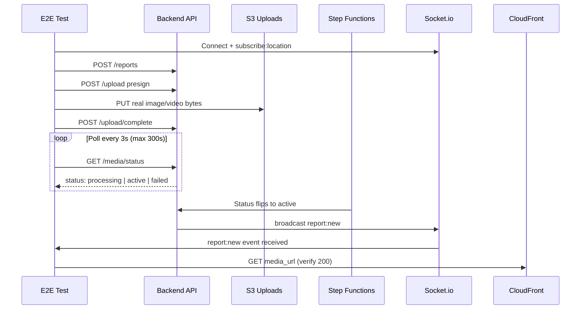

# E2E Media Pipeline Tests

## Goal

Add a suite of true end-to-end tests that upload real media files through the full production pipeline (S3 → EventBridge → Step Functions → Rekognition/MediaConvert → CloudFront) and verify everything works, including the WebSocket broadcast when reports become active.

These tests run **on-demand** (manual trigger) and **nightly** (scheduled), **not on every PR**, to avoid slowing down CI and costing money on every merge.

## Context

The existing `integration-tests/src/production.test.ts` and `contract.test.ts` only verify HTTP response shapes. They do not upload real files to S3 or wait for Step Functions / Rekognition / MediaConvert to finish. We need a separate test suite that does this end-to-end.

### Pipeline background

Read `backend/api/src/routes/reports.ts` lines 163-328 and `infrastructure/aws/lib/media/media-stack.ts` for the full picture. The flow is:

1. Client calls `POST /api/v1/reports` → receives report with `status: pending`
2. Client calls `POST /api/v1/reports/:id/upload` with `{ device_id, file_type, content_type }` → receives `{ upload_url, media_key, expires_in }`
3. Client does `PUT` to `upload_url` with raw file bytes and `Content-Type` header matching the requested type
4. Client calls `POST /api/v1/reports/:id/upload/complete` with `{ device_id, media_key }` → backend verifies file exists in S3 and flips status to `processing`
5. S3 upload triggers EventBridge → Step Functions state machine
6. For images: `Rekognition.detectModerationLabels` (sync) → if not flagged, copy to media bucket
7. For videos: `Rekognition.startContentModeration` (async, polled) → if not flagged, submit MediaConvert transcode job
8. Client polls `GET /api/v1/reports/:id/media/status` every few seconds. The backend checks if the processed file exists in the media bucket. Once all media is `active`, the report flips to `active` and the backend emits a `report:new` WebSocket event
9. WebSocket subscribers in overlapping location grid rooms receive the event

### Test sequence diagram



## Branch

`feat/e2e-media-pipeline-tests`

## Files to create

1. **`integration-tests/src/media-pipeline.e2e.test.ts`** — new test file (separate from `production.test.ts` and `contract.test.ts`)
2. **`integration-tests/fixtures/test-image.jpg`** — tiny committed JPEG (~1-5 KB, 10x10 solid color)
3. **`integration-tests/fixtures/test-video.mp4`** — tiny committed MP4 (~50-200 KB, 1-2 seconds of black frame, H.264)
4. **`integration-tests/jest.e2e.config.ts`** — separate Jest config with longer timeout (5 minutes)
5. **`.github/workflows/e2e-media.yml`** — new workflow triggered on-demand + nightly schedule

## Files to modify

6. **`integration-tests/package.json`** — add `socket.io-client`, `axios` dependencies, add `test:e2e` script
7. **`integration-tests/jest.config.ts`** — exclude `*.e2e.test.ts` from default `testMatch` so E2E tests only run via `test:e2e`

## Detailed instructions

### 1. Add dependencies to `integration-tests/package.json`

Add to `devDependencies`:
```json
"axios": "^1.6.0",
"socket.io-client": "^4.7.0"
```

Add to `scripts`:
```json
"test:e2e": "jest --config jest.e2e.config.ts"
```

Keep the existing `"test": "jest"` script unchanged — it will still run only `production.test.ts` and `contract.test.ts`.

### 2. Create `integration-tests/jest.e2e.config.ts`

```typescript
import type { Config } from 'jest';

const config: Config = {
  preset: 'ts-jest',
  testEnvironment: 'node',
  roots: ['<rootDir>/src'],
  testMatch: ['**/*.e2e.test.ts'],
  testTimeout: 300_000,
  clearMocks: true,
};

export default config;
```

### 3. Update default `integration-tests/jest.config.ts`

Exclude `.e2e.test.ts` files from the default test matcher so E2E tests do not run in the normal integration-tests job:

```typescript
testMatch: ['**/*.test.ts', '!**/*.e2e.test.ts'],
```

### 4. Create test fixtures

**`integration-tests/fixtures/test-image.jpg`**: generate a tiny valid JPEG. One way:
```bash
# From the repo root, with ImageMagick installed:
convert -size 10x10 xc:red integration-tests/fixtures/test-image.jpg
```
Alternative: use a Node script with `sharp` to generate it, or commit the bytes of a known-valid 10x10 red JPEG (~400 bytes). Target size: 1-5 KB.

**`integration-tests/fixtures/test-video.mp4`**: generate with ffmpeg:
```bash
ffmpeg -f lavfi -i color=black:size=320x240:rate=30 -t 1 \
  -c:v libx264 -pix_fmt yuv420p \
  integration-tests/fixtures/test-video.mp4
```
Target size: 50-200 KB. Commit to repo as a binary file.

Ensure `.gitignore` does **not** exclude these fixtures.

### 5. Create `integration-tests/src/media-pipeline.e2e.test.ts`

Required structure:

```typescript
import fs from 'fs';
import path from 'path';
import request from 'supertest';
import axios from 'axios';
import { io, Socket } from 'socket.io-client';

const API_URL = process.env.API_URL;
const WS_URL = process.env.WS_URL ?? API_URL?.replace(/^http/, 'ws');

if (!API_URL || !WS_URL) {
  throw new Error('API_URL (and optionally WS_URL) env vars required');
}

const UA = 'CrimeReport-E2EMediaTests/1.0';
const get = (p: string) => request(API_URL).get(p).set('User-Agent', UA);
const post = (p: string) => request(API_URL).post(p).set('User-Agent', UA);

const TEST_LAT = 40.7128;
const TEST_LNG = -74.006;

function testDeviceId() {
  return `e2e-media-${Date.now()}-${Math.random().toString(36).slice(2, 8)}`;
}

async function connectWs(deviceId: string): Promise<Socket> {
  const ws = io(WS_URL!, {
    auth: { deviceId },
    transports: ['websocket'],
  });
  await new Promise<void>((resolve, reject) => {
    ws.on('connect', () => resolve());
    ws.on('connect_error', reject);
  });
  return ws;
}

async function waitForTerminalStatus(
  reportId: string,
  maxSeconds: number,
): Promise<string> {
  const deadline = Date.now() + maxSeconds * 1000;
  while (Date.now() < deadline) {
    const res = await get(`/api/v1/reports/${reportId}/media/status`);
    if (res.status === 200 && (res.body.status === 'active' || res.body.status === 'failed')) {
      return res.body.status;
    }
    await new Promise((r) => setTimeout(r, 3000));
  }
  throw new Error(`report ${reportId} did not reach terminal status within ${maxSeconds}s`);
}

async function uploadMedia(opts: {
  deviceId: string;
  reportId: string;
  filePath: string;
  fileType: 'image' | 'video';
  contentType: string;
}): Promise<void> {
  const presign = await post(`/api/v1/reports/${opts.reportId}/upload`).send({
    device_id: opts.deviceId,
    file_type: opts.fileType,
    content_type: opts.contentType,
  });
  expect(presign.status).toBe(201);

  const bytes = fs.readFileSync(opts.filePath);
  await axios.put(presign.body.upload_url, bytes, {
    headers: {
      'Content-Type': opts.contentType,
      'Content-Length': bytes.length,
    },
    maxBodyLength: Infinity,
  });

  const complete = await post(`/api/v1/reports/${opts.reportId}/upload/complete`).send({
    device_id: opts.deviceId,
    media_key: presign.body.media_key,
  });
  expect(complete.status).toBe(200);
}
```

**Test A: Image upload end-to-end** (`jest.setTimeout(120_000)` inline):
- Setup: create device id, connect WebSocket, emit `subscribe:location` with `{ lat, lng }`, set up listener for `report:new` event
- Create report via `POST /reports`
- Upload `fixtures/test-image.jpg` using `uploadMedia` helper
- `waitForTerminalStatus(reportId, 90)` → expect `'active'`
- `GET /reports/:id` → expect `status === 'active'`, `media[0].url` is a non-empty string
- HTTP GET the `media[0].url` directly (via axios) → expect 200
- Expect the `report:new` event to have fired with the correct report id (use `Promise.race` with a 90s timeout)
- Teardown: disconnect WebSocket

**Test B: Video upload end-to-end**:
- Same structure, but `fixtures/test-video.mp4`, `file_type: 'video'`, `content_type: 'video/mp4'`
- `waitForTerminalStatus(reportId, 300)` → expect `'active'`
- Additionally expect `media[0].thumbnail_url` to be a non-empty string that also returns 200

**Test C: Invalid content type is rejected**:
- `POST /upload` with `content_type: 'image/gif'` (not in backend allowlist)
- Expect 400

**WebSocket pattern for report:new assertion**:
```typescript
const broadcastPromise = new Promise<{ id: string }>((resolve) => {
  ws.on('report:new', (data) => resolve(data));
});
// ... do upload flow ...
const event = await Promise.race([
  broadcastPromise,
  new Promise<{ id: string }>((_, reject) =>
    setTimeout(() => reject(new Error('no report:new broadcast within 90s')), 90_000),
  ),
]);
expect(event.id).toBe(reportId);
```

### 6. Create `.github/workflows/e2e-media.yml`

```yaml
name: E2E Media Pipeline

on:
  workflow_dispatch:
  schedule:
    - cron: '0 6 * * *' # daily at 06:00 UTC

concurrency:
  group: e2e-media-production
  cancel-in-progress: false

permissions:
  contents: read
  id-token: write

jobs:
  e2e-media:
    name: E2E Media Pipeline
    runs-on: ubuntu-latest
    defaults:
      run:
        working-directory: integration-tests
    steps:
      - uses: actions/checkout@v4

      - uses: actions/setup-node@v4
        with:
          node-version: 20
          cache: npm
          cache-dependency-path: integration-tests/package-lock.json

      - run: npm ci

      - uses: aws-actions/configure-aws-credentials@v4
        with:
          role-to-assume: arn:aws:iam::${{ vars.AWS_ACCOUNT_ID }}:role/crimereport-github-deploy
          aws-region: ${{ vars.AWS_REGION || 'us-east-1' }}

      - name: Get ALB DNS
        id: alb
        run: |
          DNS=$(aws cloudformation describe-stacks \
            --stack-name CrimeReport-Compute \
            --query "Stacks[0].Outputs[?OutputKey=='AlbDnsName'].OutputValue" \
            --output text)
          echo "dns=$DNS" >> "$GITHUB_OUTPUT"

      - name: Run E2E media pipeline tests
        env:
          API_URL: http://${{ steps.alb.outputs.dns }}
          WS_URL: ws://${{ steps.alb.outputs.dns }}
        run: npm run test:e2e
```

## Verification

Before opening the PR:

- `cd integration-tests && npx tsc --noEmit` passes
- `cd integration-tests && npm run test -- --listTests` shows `production.test.ts` and `contract.test.ts` but **not** `media-pipeline.e2e.test.ts`
- `cd integration-tests && npm run test:e2e -- --listTests` shows only `media-pipeline.e2e.test.ts`
- Test fixtures are committed and visible in `git ls-files`
- `.github/workflows/e2e-media.yml` passes a YAML lint (`yamllint` or a GitHub Actions preview)

## Do NOT

- Delete or modify `production.test.ts` or `contract.test.ts`
- Run actual E2E tests during development (they need a deployed backend — the CI workflow will run them). Running `npm run test:e2e` without `API_URL` set should throw a clear error.
- Touch any Flutter or backend code — this PR is purely additive in `integration-tests/` and `.github/workflows/`

## PR description

Title: `test: add E2E media pipeline tests (runs on-demand + nightly)`

Body should explain:
- What the tests verify (full pipeline from presign → S3 PUT → Step Functions → CloudFront → WebSocket)
- How to run manually: `cd integration-tests && API_URL=http://<alb-dns> WS_URL=ws://<alb-dns> npm run test:e2e`
- How to trigger in GitHub: Actions tab → E2E Media Pipeline → Run workflow
- Nightly schedule (06:00 UTC) for pipeline health monitoring
- Note that tests intentionally do not clean up created reports (they age out via normal feed filtering)

## Why this approach

| Concern | How addressed |
|---|---|
| Slow CI on every PR | Tests run only on-demand + nightly, never on PR |
| Cost of MediaConvert/Rekognition | Once per day max, tiny test files, predictable small bill |
| Flakiness from AWS | Nightly runs surface intermittent issues; not blocking PRs |
| Production data pollution | Test reports tagged with `e2e-media-*` device_id pattern for filtering; they appear briefly in the feed but are harmless |
| Cleanup | Not critical — reports age out of nearby queries naturally; S3 lifecycle rules handle uploads bucket |

## What these tests catch that current tests don't

- S3 presigned URL accepts PUTs with real bytes and correct headers
- EventBridge rule fires on `Object Created`
- Step Functions state machine runs without errors
- Rekognition moderation completes for valid content
- MediaConvert transcodes video to the expected output format
- CloudFront distribution serves the final media file
- WebSocket `report:new` broadcast actually fires when status flips to active
- Full status transition: `pending` → `processing` → `active`
