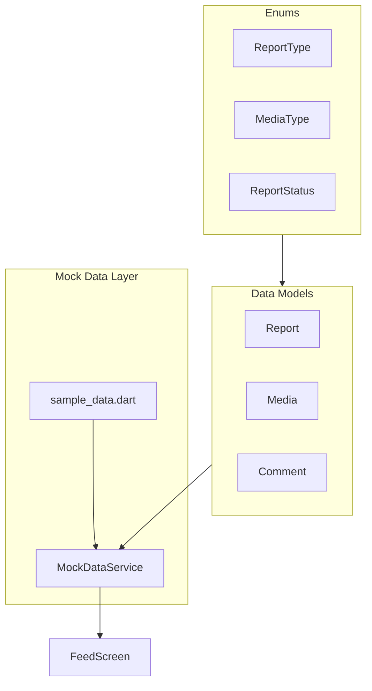

# Milestone 2: Data Models & Mock Data

## Overview

Create the data layer foundation with models, enums, and a mock data service. This will provide realistic test data for building the feed UI in Milestone 3 without needing a backend.

## Architecture



## Files to Create (6 total)

### 1. Enums - `lib/core/constants/enums.dart`

Define crime types with display names and colors that match the existing `AppColors.crimeX` colors in [colors.dart](apps/mobile/lib/core/theme/colors.dart):

```dart
enum ReportType {
  theft,      // AppColors.crimeTheft (orange)
  assault,    // AppColors.crimeAssault (red)
  vandalism,  // AppColors.crimeVandalism (purple)
  suspicious, // AppColors.crimeSuspicious (yellow)
  drugActivity,
  disturbance,
  other;
  
  String get displayName => ...
  Color get color => ...
}

enum MediaType { video, image }
enum ReportStatus { pending, verified, flagged, removed }
```

### 2. Media Model - `lib/features/feed/data/models/media.dart`

```dart
class Media {
  final String id;
  final String reportId;
  final MediaType type;
  final String url;
  final String? thumbnailUrl;
  final int? durationMs;
  final int width;
  final int height;
  final DateTime createdAt;
  
  // JSON serialization for future API integration
}
```

### 3. Report Model - `lib/features/feed/data/models/report.dart`

```dart
class Report {
  final String id;
  final String deviceId;
  final ReportType type;
  final String description;
  final double latitude;
  final double longitude;
  final String? address;
  final List<Media> media;
  final int upvotes;
  final int commentCount;
  final DateTime createdAt;
  final ReportStatus status;
  double? distanceKm;  // Computed from user location
  
  // JSON serialization
  // copyWith method for state updates
}
```

### 4. Comment Model - `lib/features/feed/data/models/comment.dart`

```dart
class Comment {
  final String id;
  final String reportId;
  final String deviceId;
  final String content;
  final int upvotes;
  final DateTime createdAt;
  final bool isReporter;  // Same device as original reporter
  
  // JSON serialization
}
```

### 5. Sample Data - `lib/shared/data/sample_data.dart`

Contains raw mock data:
- 10 crime reports with varied types (theft, assault, vandalism, etc.)
- Locations around San Francisco (matching `AppConstants.defaultLatitude/Longitude`)
- Sample video URLs from Google's public test videos:
  - `https://commondatastorage.googleapis.com/gtv-videos-bucket/sample/ForBiggerBlazes.mp4`
  - `https://commondatastorage.googleapis.com/gtv-videos-bucket/sample/ForBiggerEscapes.mp4`
  - etc.
- 3-5 mock comments per report
- Realistic descriptions for each crime type

### 6. Mock Data Service - `lib/shared/data/mock_data_service.dart`

Singleton service with query methods:

```dart
class MockDataService {
  static final instance = MockDataService._();
  
  List<Report> getReports();
  List<Report> getNearbyReports(double lat, double lng, double radiusKm);
  List<Report> getReportsAtLocation(double lat, double lng);
  Report? getReportById(String id);
  List<Comment> getCommentsForReport(String reportId);
  
  // Distance calculation using Haversine formula
}
```

## Folder Structure

```
lib/
├── core/
│   └── constants/
│       ├── app_constants.dart  (existing)
│       └── enums.dart          (NEW)
├── features/
│   └── feed/
│       └── data/
│           └── models/
│               ├── report.dart  (NEW)
│               ├── media.dart   (NEW)
│               └── comment.dart (NEW)
└── shared/
    └── data/
        ├── mock_data_service.dart (NEW)
        └── sample_data.dart       (NEW)
```

## Deliverables

- Report model with JSON serialization and `copyWith`
- Media model supporting both video and image types
- Comment model with reporter identification
- Enums with display names and color mappings
- 10 mock reports covering all crime types
- Sample videos that will work with `video_player` package
- Distance-based filtering for map integration
- Comments linked to reports