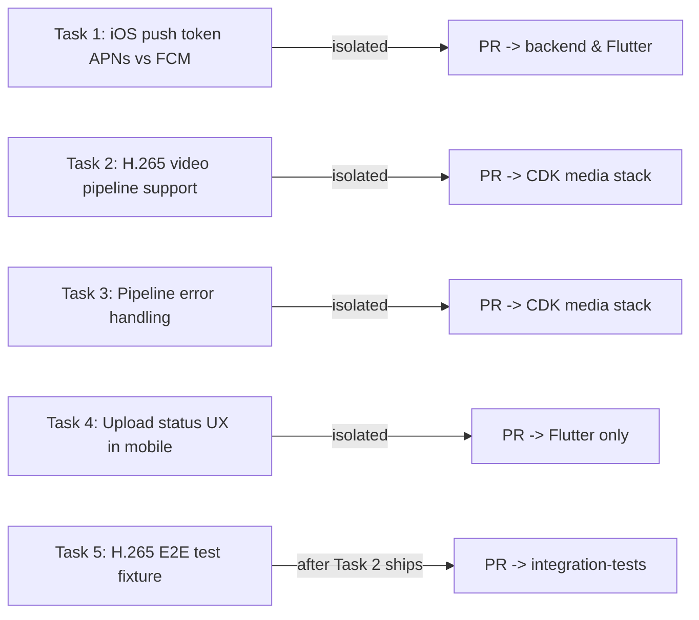

# Mobile + Media Pipeline Follow-up Fixes

## Background

During initial end-to-end testing on a real iPhone (April 30, 2026) with the contract fixes from PR #16 in place and the upload `device_id` fix on `fix/ios-store-prep`, we discovered five issues that the existing test suites did not catch:

1. **Push notification `POST /register` returns 500** — backend tries to register an FCM token with AWS SNS as if it were an APNs device token. APNs requires 64 hex chars; FCM tokens are ~150 chars with colons.
2. **iOS video uploads fail in the pipeline** — iPhones record H.265 (HEVC) by default, AWS Rekognition only supports H.264. Status flips from `processing` → `failed`.
3. **Pipeline silently destroys failed videos** — when Rekognition reports any failure (including unsupported codec), the Step Functions state machine routes to `DeleteFlaggedContent` and marks status `FLAGGED`, treating the video as if it was inappropriate content.
4. **Mobile UX shows "Report submitted!" even when processing later fails** — the `UploadNotifier` in `upload_provider.dart` stops at `done` once S3 confirms; the user never learns that processing failed.
5. **The new E2E media test cannot catch the iOS codec issue** — its test fixture is a hand-built H.264 MP4 from ffmpeg, so it always passes while real iOS uploads fail.

The five tasks below are independent and can be assigned to separate cloud agents in parallel. Each is scoped tight enough to fit into a single PR.



Tasks 1, 2, 3, and 4 are fully parallel. Task 5 depends on Task 2 being merged first (otherwise the test will continue to fail).

---

## Task 1: Fix iOS push notification token (APNs vs FCM)

### Branch

`fix/ios-apns-token`

### Background

The Flutter app calls `firebase_messaging.getToken()` on both iOS and Android, returning an FCM-formatted token. The backend then passes that token to AWS SNS `CreatePlatformEndpoint` with the iOS platform application ARN, which expects a raw 64-character hex APNs device token. SNS rejects with:

```
InvalidParameterException: Invalid parameter: Token Reason: iOS device tokens
must be no more than 400 hexadecimal characters
```

This causes a 500 from `POST /api/v1/notifications/register` for every iOS user. As a downstream effect, every `PUT /preferences` call returns 404 "No push subscription found for this device".

### Fix

On iOS, send the **APNs token** (`firebase_messaging.getAPNSToken()`). On Android, keep using the FCM token (`firebase_messaging.getToken()`). The backend already accepts the platform identifier in the body, so no backend change is needed.

### Files to modify

- [apps/mobile/lib/shared/services/push_notification_service.dart](apps/mobile/lib/shared/services/push_notification_service.dart) — add a `getDeviceToken()` method that returns the APNs token on iOS and FCM token on Android. Wait for APNs token to be available before returning.
- [apps/mobile/lib/shared/providers/notification_providers.dart](apps/mobile/lib/shared/providers/notification_providers.dart) — call the new method instead of `getToken()`.
- [apps/mobile/test/shared/services/push_notification_service_test.dart](apps/mobile/test/shared/services/push_notification_service_test.dart) — new test file (or extend existing) for the platform branch logic.

### Considerations

- `getAPNSToken()` may return `null` if APNs has not yet completed registration. Implement a retry with timeout (e.g., poll every 500ms for up to 10 seconds before giving up).
- On Android, `getToken()` works as-is.
- Keep the `fcm_token` field name in the API payload — the backend treats it as opaque token text. Renaming would require a backend change.

### Testing

- `cd apps/mobile && flutter analyze && flutter test`
- Manual on physical iPhone: app launch should produce `POST /api/v1/notifications/register` with **201**, not 500
- The `device_id` should now appear in the `push_subscriptions` DB table

### Detailed prompt for cloud agent

> Fix the iOS push notification registration that fails with HTTP 500 because the Flutter app sends an FCM-formatted token to AWS SNS, which expects a 64-character hex APNs device token on iOS.
>
> **Branch:** `fix/ios-apns-token`
>
> **Detailed plan:** Read `docs/design/mobile_pipeline_followup_tasks.plan.md` Task 1 section.
>
> **Implementation:**
> 1. In `apps/mobile/lib/shared/services/push_notification_service.dart`, add a `Future<String?> getDeviceToken()` method that:
>    - On iOS: calls `_messaging.getAPNSToken()`, retrying every 500ms for up to 10 seconds if it returns null (APNs registration is async). Returns null on timeout with a debug log.
>    - On Android: returns `_messaging.getToken()`.
>    - On web/unknown: returns `_messaging.getToken()`.
> 2. In `apps/mobile/lib/shared/providers/notification_providers.dart`:
>    - Replace the `pushService.getToken()` call in `initNotificationsProvider` with `pushService.getDeviceToken()`.
>    - Replace the `onTokenRefresh.listen` body to also use the new method (the FCM `onTokenRefresh` only fires for FCM token refresh; for APNs, the token is stable across launches but consider handling it).
> 3. Add unit tests in `apps/mobile/test/shared/services/push_notification_service_test.dart` mocking `FirebaseMessaging`. Cover: iOS returns APNs token immediately, iOS times out and returns null, Android returns FCM token.
>
> **Verification:**
> - `cd apps/mobile && flutter analyze` clean
> - `cd apps/mobile && flutter test` all pass
>
> **Do NOT:**
> - Modify backend code (the backend correctly forwards whatever token it receives to SNS; the bug is purely client-side).
> - Change the `fcm_token` field name in the request body (backend treats it as opaque).
>
> Open a PR to main when done.

---

## Task 2: Support H.265 (HEVC) video uploads from iOS

### Branch

`fix/h265-video-pipeline`

### Background

iPhones (and many Android devices) record video in H.265 / HEVC by default. AWS Rekognition Video does **not** support H.265 — only H.264 (AVC) and MPEG-4 Part 2. When the Step Functions state machine submits an H.265 video to Rekognition, it returns:

```json
{
  "JobStatus": "FAILED",
  "StatusMessage": "Unsupported codec/format."
}
```

This triggers the `IsVideoFlagged` choice's `otherwise` branch, which routes to `DeleteFlaggedContent` — the user's video is deleted from S3 and the report is marked `failed`.

### Fix options (cloud agent decides which is feasible)

**Option A: Force H.264 on the client.** Add codec configuration to the Flutter `camera` plugin to record in H.264. This package has limited iOS codec configuration; investigate `ResolutionPreset.medium` or lower (which historically falls back to H.264 on iOS), or whether a platform channel addition is needed.

**Option B: Transcode before moderation (preferred).** Refactor the Step Functions state machine so the **video** path is:
1. Submit MediaConvert job (always — converts H.265 to H.264 + thumbnails)
2. Wait for MediaConvert to complete
3. Run Rekognition on the **transcoded H.264 output** in the media bucket (not the raw upload)
4. If flagged, delete from media bucket; otherwise mark active

This is more robust because it accepts any input codec MediaConvert supports.

The cloud agent should evaluate both and pick Option B if MediaConvert can be trusted (it can; MediaConvert supports HEVC input natively). Option A is brittle because users can also upload from gallery.

### Files to modify (Option B path)

- [infrastructure/aws/lib/media/media-stack.ts](infrastructure/aws/lib/media/media-stack.ts) — refactor `buildPipelineDefinition()` to:
  - Move `submitTranscode` (Lambda) before video moderation
  - Wait for MediaConvert completion (poll the job status, similar to how Rekognition video moderation polls)
  - Then run `StartVideoModeration` against the transcoded media-bucket key (not the uploads-bucket key)
  - On flagged: delete from media bucket
  - On clean: mark active (no copy step needed since MediaConvert wrote to media bucket directly)

- [backend/functions/transcode-trigger/index.ts](backend/functions/transcode-trigger/index.ts) — verify the Lambda returns enough info (output S3 key) for Step Functions to know where to find the transcoded file.

- [infrastructure/aws/test/media/media-stack.test.ts](infrastructure/aws/test/media/media-stack.test.ts) — extend tests to assert the new pipeline structure.

### Considerations

- MediaConvert can take 1-3 minutes for short videos. The Step Functions timeout is 30 minutes — plenty of headroom.
- The `transcode-trigger` Lambda currently submits the job; it does not wait. Add a polling loop or use the MediaConvert job state change EventBridge pattern.
- Image path is unchanged (Rekognition `detectModerationLabels` works on JPEG/PNG/WebP).
- `MediaConvertSetting` in CDK should already produce H.264 output; verify it does.

### Testing

- `cd infrastructure/aws && npm test`
- After deploy, manual iPhone test: upload a video, verify it eventually flips to `active` (within 3 minutes)
- The existing `media-pipeline.e2e.test.ts` should still pass (its ffmpeg H.264 fixture still works)
- Task 5 will add an H.265 fixture that proves this fix works

### Detailed prompt for cloud agent

> Refactor the media pipeline Step Functions state machine so iOS H.265 (HEVC) video uploads work. Current behavior: AWS Rekognition rejects H.265 videos with "Unsupported codec/format" and the user's video is deleted as if it was flagged content.
>
> **Branch:** `fix/h265-video-pipeline`
>
> **Detailed plan:** Read `docs/design/mobile_pipeline_followup_tasks.plan.md` Task 2 section.
>
> **Approach:** Use Option B from the plan — transcode FIRST (MediaConvert handles H.265 → H.264), then run Rekognition on the transcoded output. This is robust because MediaConvert supports any codec the user might upload.
>
> **Implementation:**
> 1. In `infrastructure/aws/lib/media/media-stack.ts` `buildPipelineDefinition()`, refactor the video path:
>    - Submit MediaConvert job FIRST (re-use existing `transcode-trigger` Lambda)
>    - Wait for MediaConvert to finish (poll job status; can use `aws-stepfunctions-tasks` `MediaConvertCreateJob` if available, or manual polling task similar to existing Rekognition wait pattern)
>    - Once MediaConvert is done, the H.264 output is in the media bucket
>    - Submit Rekognition `StartContentModeration` against the transcoded file
>    - Wait for Rekognition (existing pattern reused)
>    - If flagged: delete the transcoded file from media bucket; mark report failed
>    - If clean: mark report active (broadcast handled by polling endpoint)
> 2. Update `backend/functions/transcode-trigger/index.ts` if needed to return the output media-bucket key so downstream Step Functions tasks know where to find the transcoded file.
> 3. Update `infrastructure/aws/test/media/media-stack.test.ts` to assert the new state machine structure (use `Match.objectLike` for the Step Functions definition).
> 4. Image path remains unchanged.
>
> **Verification:**
> - `cd infrastructure/aws && npm test` all pass
> - `cd infrastructure/aws && npx cdk synth CrimeReport-Media` succeeds and shows the new state machine in the synthesized template
>
> **Do NOT:**
> - Modify the Flutter mobile app code.
> - Modify the image path in the state machine — only the video path needs to change.
> - Lower the Step Functions timeout (30 minutes is the max acceptable end-to-end time).
>
> Open a PR to main when done. The PR description should call out that this is a CDK change requiring a deploy to take effect.

---

## Task 3: Improve media pipeline error handling

### Branch

`fix/pipeline-error-classification`

### Background

The current Step Functions state machine treats any non-`SUCCEEDED` Rekognition result as flagged content:

```typescript
const checkJobStatus = new sfn.Choice(this, 'CheckVideoJobStatus')
  .when(sfn.Condition.stringEquals('$.videoResults.JobStatus', 'IN_PROGRESS'), waitForModeration)
  .when(sfn.Condition.stringEquals('$.videoResults.JobStatus', 'SUCCEEDED'), isVideoFlagged)
  .otherwise(deleteFlagged); // catches FAILED for ANY reason
```

This means a Rekognition outage, an unsupported codec, or any AWS-side failure all manifest as "your content was flagged for inappropriate material" — confusing and wrong.

### Fix

Distinguish three outcomes:

1. **Moderation succeeded + clean** → proceed to active
2. **Moderation succeeded + flagged** → delete content, mark failed (existing behavior)
3. **Moderation failed (system error)** → mark report `failed` with a different reason, **do NOT delete the user's upload**, and emit a CloudWatch alarm so ops can investigate

### Files to modify

- [infrastructure/aws/lib/media/media-stack.ts](infrastructure/aws/lib/media/media-stack.ts) — add a new branch for the FAILED case that does not delete content. The `failed` status should propagate to the report so the user knows it failed. Consider a new state machine output like `{ status: 'PROCESSING_ERROR', reason: ... }` distinct from `{ status: 'FLAGGED' }`.
- [backend/api/src/routes/reports.ts](backend/api/src/routes/reports.ts) — the `media/status` endpoint currently treats `media.status === 'failed'` uniformly. Consider adding a `failure_reason` field (one of `flagged_content`, `processing_error`, `unsupported_format`).
- [backend/api/src/models/media.ts](backend/api/src/models/media.ts) and the migration files — add a nullable `failure_reason` column.
- [infrastructure/aws/lib/monitoring/monitoring-stack.ts](infrastructure/aws/lib/monitoring/monitoring-stack.ts) — add a CloudWatch alarm on Step Functions failed executions distinct from successful-but-flagged.

### Considerations

- This is a **breaking change to the state machine output shape**. Coordinate with the polling endpoint to handle both shapes during the deploy window.
- The migration must be backward-compatible (add nullable column, no defaults required).
- Do not block this task on Task 2 (they can ship in either order; with Task 2 alone, this kind of error becomes much rarer).

### Testing

- `cd backend/api && npm test`
- `cd infrastructure/aws && npm test`

### Detailed prompt for cloud agent

> Improve media pipeline error handling so AWS-side failures (e.g., Rekognition unsupported codec, transient outages) are not treated as content moderation rejections.
>
> **Branch:** `fix/pipeline-error-classification`
>
> **Detailed plan:** Read `docs/design/mobile_pipeline_followup_tasks.plan.md` Task 3 section.
>
> **Implementation:**
> 1. In `infrastructure/aws/lib/media/media-stack.ts` `buildPipelineDefinition()`:
>    - Add a `ProcessingError` Pass state: `result: { status: 'PROCESSING_ERROR', reason: <from Rekognition StatusMessage> }`. Does NOT delete the user's upload from S3.
>    - Modify `checkJobStatus` Choice: route `JobStatus === 'FAILED'` to the new state, NOT to `deleteFlagged`.
>    - Same for the image path (Rekognition `detectModerationLabels` errors should be classified as `PROCESSING_ERROR`, not flagged).
> 2. Add a new migration `backend/api/migrations/<timestamp>_add-media-failure-reason.sql` adding a nullable `failure_reason` column to the `media` table.
> 3. Update `backend/api/src/models/media.ts` to expose the new field. Update `media/status` route handler in `backend/api/src/routes/reports.ts` to include it in the response.
> 4. Update Flutter `Media.fromJson` in `apps/mobile/lib/features/feed/data/models/media.dart` to optionally parse `failure_reason`.
> 5. Add a CloudWatch alarm in `infrastructure/aws/lib/monitoring/monitoring-stack.ts` on the `MediaPipelineProcessingErrors` metric (count of executions ending in `ProcessingError` Pass state).
> 6. Update tests in `infrastructure/aws/test/media/media-stack.test.ts` and `backend/api/src/__tests__/`.
>
> **Verification:**
> - `cd backend/api && npm test`
> - `cd infrastructure/aws && npm test`
> - `cd integration-tests && npx tsc --noEmit`
>
> **Do NOT:**
> - Change the state machine timeout.
> - Drop or rename existing fields on the `media` table.
> - Change the response shape of `media/status` in a backward-incompatible way (add `failure_reason` as a new optional field; do not modify existing fields).
>
> Open a PR to main when done.

---

## Task 4: Surface processing failures in the mobile app

### Branch

`feat/upload-status-polling`

### Background

The current `UploadNotifier` in `apps/mobile/lib/features/submit/providers/upload_provider.dart` stops at `done` once the S3 upload-complete call succeeds. The user sees "Report submitted!" and assumes everything worked. They have no way to learn that:
- Rekognition flagged the content
- The pipeline failed for any reason
- The video format was unsupported

### Fix

Wire the existing `UploadService.pollMediaStatus()` (which polls `/media/status` every 3s for up to 3 minutes) into the upload flow. After `confirmUpload` succeeds:

1. Transition to `UploadPhase.processing` (already exists in the enum)
2. Call `pollMediaStatus()` and listen for terminal events
3. On `active`: transition to `done`
4. On `failed`: transition to `error` with a descriptive message based on `failure_reason` (depends on Task 3)

### Files to modify

- [apps/mobile/lib/features/submit/providers/upload_provider.dart](apps/mobile/lib/features/submit/providers/upload_provider.dart) — wire up the polling after `confirmUpload`. Update state transitions.
- [apps/mobile/lib/features/submit/presentation/widgets/upload_overlay.dart](apps/mobile/lib/features/submit/presentation/widgets/upload_overlay.dart) — already shows different status text per phase; verify "Processing..." displays correctly.
- [apps/mobile/test/features/submit/providers/upload_provider_test.dart](apps/mobile/test/features/submit/providers/upload_provider_test.dart) — new tests covering the polling phase.

### Considerations

- Keep the polling cancellable via the existing `_cancelToken` — if the user closes the screen, polling should stop
- Polling timeout is 3 minutes (current); after that, surface a "still processing in background" message with a link to the feed where the report will eventually appear
- Don't block the user on the success screen — let them dismiss after `done` even if they want to do other things

### Testing

- `cd apps/mobile && flutter analyze && flutter test`
- Manual: upload a photo, verify "Processing media..." appears and then "Report submitted!" once active

### Detailed prompt for cloud agent

> Wire up the existing `UploadService.pollMediaStatus()` method into the `UploadNotifier` so the user sees real processing status instead of a premature "Report submitted!" message.
>
> **Branch:** `feat/upload-status-polling`
>
> **Detailed plan:** Read `docs/design/mobile_pipeline_followup_tasks.plan.md` Task 4 section.
>
> **Implementation:**
> 1. In `apps/mobile/lib/features/submit/providers/upload_provider.dart`:
>    - After `confirmUpload` returns successfully, transition to `UploadPhase.processing`.
>    - Subscribe to `_uploadService.pollMediaStatus(reportId)`. The stream yields `MediaPollResult` until terminal (active or failed).
>    - On `active`: transition to `UploadPhase.done`.
>    - On `failed`: transition to `UploadPhase.error` with an appropriate `errorMessage` (use the new `failure_reason` field if available, otherwise a generic "Your media couldn't be processed. Please try again.").
>    - On polling timeout (no terminal status within 3 minutes): transition to `done` with a snackbar-style message: "Your report is still processing. It will appear in the feed shortly."
> 2. Verify `apps/mobile/lib/features/submit/presentation/widgets/upload_overlay.dart` correctly displays `processing` phase status text (it already has the case in the enum's `statusText` getter).
> 3. Add tests in `apps/mobile/test/features/submit/providers/upload_provider_test.dart` mocking `UploadService.pollMediaStatus` and `ReportRepository`. Cover: successful processing, failed processing with reason, polling timeout.
>
> **Verification:**
> - `cd apps/mobile && flutter analyze && flutter test`
>
> **Do NOT:**
> - Block the user from navigating away while processing — the overlay should be dismissible (it already is).
> - Add new HTTP endpoints (use existing `/media/status`).
>
> Open a PR to main when done.

---

## Task 5: E2E test for H.265 video upload

### Dependency

**Blocked on Task 2 merging.** Without the H.265 pipeline support, this test will always fail.

### Branch

`test/e2e-h265-video`

### Background

The new `integration-tests/src/media-pipeline.e2e.test.ts` uses an ffmpeg-generated H.264 MP4 fixture, which always passes pipeline moderation. This means the test suite would not have caught the iOS H.265 issue we just discovered. Adding a real H.265 fixture closes the gap.

### Fix

Add an H.265 video fixture and a test case that uploads it through the same E2E flow.

### Files to modify

- `integration-tests/fixtures/test-video-h265.mp4` — new binary fixture, ~50-200 KB, H.265 / HEVC encoded. Generate with: `ffmpeg -f lavfi -i color=black:size=320x240:rate=30 -t 1 -c:v libx265 -tag:v hvc1 -pix_fmt yuv420p test-video-h265.mp4`
- [integration-tests/src/media-pipeline.e2e.test.ts](integration-tests/src/media-pipeline.e2e.test.ts) — add a third describe block: "Video upload (H.265 / HEVC) end-to-end". Reuse the existing `uploadMedia`, `waitForTerminalStatus`, and `connectWs` helpers. Use a longer timeout (300s).

### Considerations

- The `tag:v hvc1` flag is critical for compatibility with Apple devices and AWS MediaConvert
- Verify the file plays in a browser before committing it
- The test will only pass after Task 2 merges and deploys; in the interim, it can be marked `it.skip` with a TODO

### Testing

- `cd integration-tests && npx tsc --noEmit`
- After Task 2 ships, manually trigger the workflow: Actions → E2E Media Pipeline → Run workflow

### Detailed prompt for cloud agent

> Add an H.265 (HEVC) video fixture and test case to the E2E media pipeline test suite, so we catch iOS-style codec issues in CI.
>
> **Branch:** `test/e2e-h265-video`
>
> **Detailed plan:** Read `docs/design/mobile_pipeline_followup_tasks.plan.md` Task 5 section.
>
> **Important:** This task depends on Task 2 (`fix/h265-video-pipeline`) being merged first. If Task 2 is not yet merged, mark the new test case with `it.skip` and add a TODO comment referencing this task.
>
> **Implementation:**
> 1. Generate a tiny H.265 / HEVC MP4 with ffmpeg:
>    ```bash
>    ffmpeg -f lavfi -i color=black:size=320x240:rate=30 -t 1 \
>      -c:v libx265 -tag:v hvc1 -pix_fmt yuv420p \
>      integration-tests/fixtures/test-video-h265.mp4
>    ```
>    Target size: 50-200 KB. The `-tag:v hvc1` flag is critical for Apple/AWS compatibility.
> 2. In `integration-tests/src/media-pipeline.e2e.test.ts`, add a new `describe` block "Video upload (H.265 / HEVC) end-to-end" mirroring the existing video test, but using `test-video-h265.mp4`. Use a 300-second timeout.
> 3. Verify the fixture file is committed (not gitignored).
>
> **Verification:**
> - `cd integration-tests && npx tsc --noEmit` clean
> - `npm run test:e2e -- --listTests` includes the file
>
> **Do NOT:**
> - Delete or modify the existing H.264 video test (both should pass after Task 2)
> - Change the workflow trigger schedule
>
> Open a PR to main when done.

---

## Dependency Graph Summary

| Task | Depends on | Blocking |
|---|---|---|
| Task 1 (iOS APNs token) | Nothing | Push notifications working on iOS |
| Task 2 (H.265 pipeline) | Nothing | iOS video uploads working |
| Task 3 (error handling) | Nothing | UX clarity when things fail |
| Task 4 (upload status polling) | Nothing (better with Task 3) | UX clarity when things fail |
| Task 5 (H.265 E2E test) | **Task 2** | Test coverage |

**Recommended deployment order:**

1. Wave 1 (parallel): Tasks 1, 2, 3, 4 — all independent
2. Wave 2: Task 5 — after Task 2 ships

After all five ship, the iOS user experience for both push notifications and video uploads should work end-to-end and surface real errors when something goes wrong.

## Cloud agent prompt summary (copy/paste each as its own agent invocation)

**Agent A (Task 1):**
> Implement Task 1 from `docs/design/mobile_pipeline_followup_tasks.plan.md`. Branch: `fix/ios-apns-token`. Read the plan section first. Open a PR to main when done.

**Agent B (Task 2):**
> Implement Task 2 from `docs/design/mobile_pipeline_followup_tasks.plan.md`. Branch: `fix/h265-video-pipeline`. Read the plan section first. Open a PR to main when done.

**Agent C (Task 3):**
> Implement Task 3 from `docs/design/mobile_pipeline_followup_tasks.plan.md`. Branch: `fix/pipeline-error-classification`. Read the plan section first. Open a PR to main when done.

**Agent D (Task 4):**
> Implement Task 4 from `docs/design/mobile_pipeline_followup_tasks.plan.md`. Branch: `feat/upload-status-polling`. Read the plan section first. Open a PR to main when done.

**Agent E (Task 5, after Agent B's PR is merged):**
> Implement Task 5 from `docs/design/mobile_pipeline_followup_tasks.plan.md`. Branch: `test/e2e-h265-video`. Read the plan section first. Open a PR to main when done.
