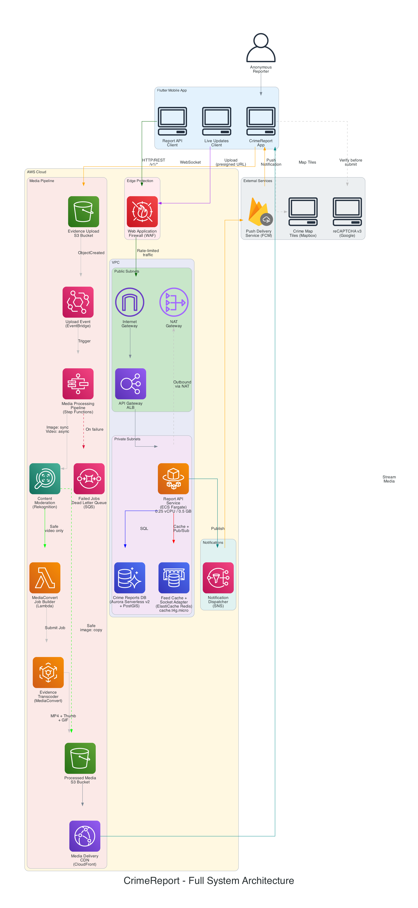
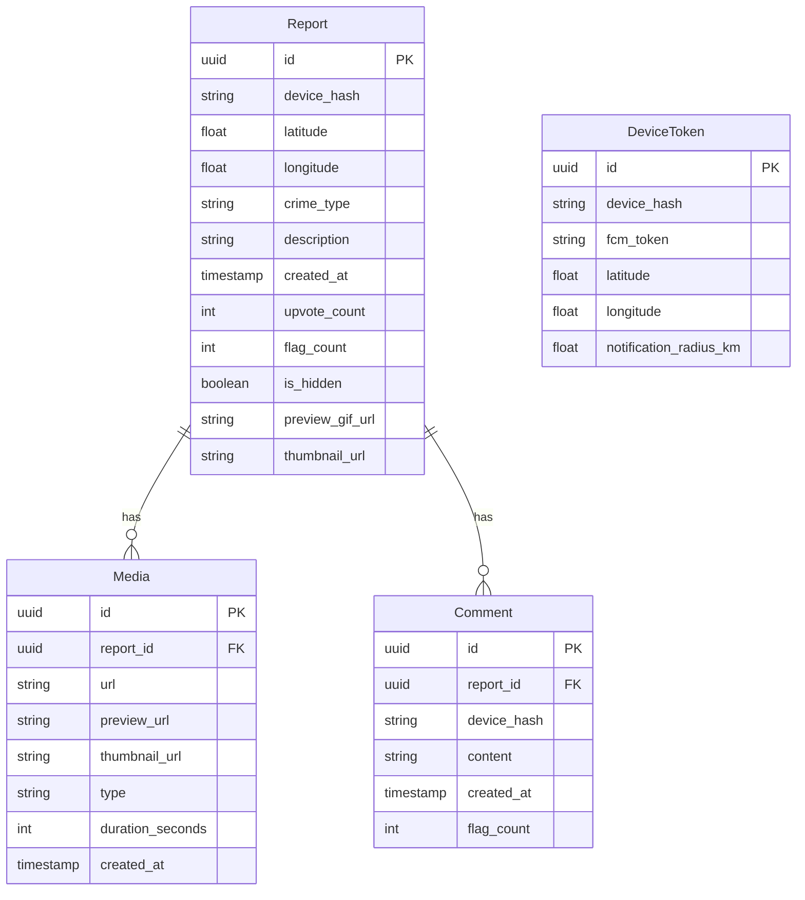
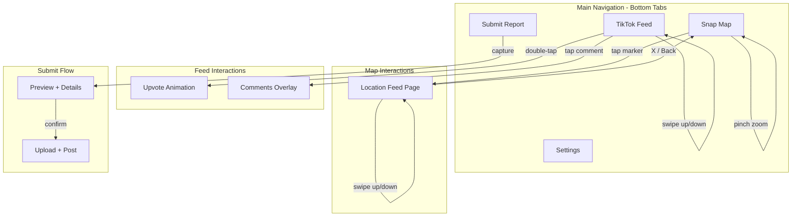

# ReportCrime App Development Plan

## Overview

**CrImEreport** is a mobile application designed to empower communities by enabling fully anonymous crime reporting. In many neighborhoods, crimes go unreported because witnesses fear retaliation, don't want to involve police, or simply find the traditional reporting process too cumbersome. CrImEreport removes these barriers by allowing anyone to instantly document and share incidents in their area without creating an account or revealing their identity.

The app reimagines crime reporting through a social media lens. Instead of filling out forms, users capture video or photos of incidents and share them with a TikTok-style interface that makes browsing reports engaging rather than anxiety-inducing. The vertical swipe feed lets users quickly see what's happening nearby, while the Snap Map-inspired map view provides geographic context—showing exactly where incidents occurred with animated thumbnail markers. When a new crime is reported, it appears instantly on everyone's feed and map through real-time WebSocket updates, creating a living, breathing awareness network for the community.

The community moderates itself through upvoting and flagging. Reports that get flagged repeatedly are automatically hidden, while highly upvoted incidents rise to prominence. Anonymous comments allow neighbors to add context ("I saw this too, happened around 3pm") without revealing who they are. Push notifications alert users when crimes occur within their chosen radius, keeping them informed without requiring them to constantly check the app.

### Core Features

- **TikTok-style feed** - Full-screen vertical swipe through crime reports with autoplay video/sound
- **Snap Map-style map** - Interactive map with animated circular thumbnails at crime locations
- **Real-time updates** - New crimes appear instantly via WebSocket (no refresh needed)
- Report crimes with GPS location, photos/videos, and descriptions
- Double-tap to upvote, side buttons for comments/share/flag
- Push notifications for crimes in your area

No user accounts required - fully anonymous by design.

---

## Privacy & Authenticity

Privacy is foundational to CrImEreport, not an afterthought. The app generates a random device identifier on first launch that gets hashed before transmission—meaning even we can't trace reports back to specific users. There are no email addresses, phone numbers, or social logins. This approach encourages reporting from people who would otherwise stay silent.

### Location Privacy

Location data requires careful handling to balance **reporter privacy** with **report authenticity**:

| Goal | Challenge |
|------|-----------|
| **Privacy** | Exact GPS coordinates could reveal reporter's home, workplace, or daily patterns |
| **Authenticity** | Without location verification, bad actors could upload fake videos claiming they happened elsewhere |

**Our approach: Trust the metadata, protect the reporter.**

The app extracts GPS coordinates directly from media EXIF data rather than allowing users to manually select a location. This ensures reports are anchored to where the video was actually recorded, preventing someone from filming at home and claiming it happened downtown. However, we never store or transmit the exact coordinates.

### Location Processing Flow

```
1. User captures video/photo
   └── Extract GPS from EXIF: (37.774923, -122.419453)
   └── Extract timestamp from EXIF

2. Validation checks (on-device)
   ├── Has GPS? → If NO, mark as "location unverified"
   ├── Is timestamp recent? → If NO (>48h), add "old video" badge
   └── Is GPS plausible? → Basic sanity check (not in ocean, etc.)

3. Privacy transformation (on-device)
   └── Round GPS to 3 decimal places (~100m precision)
       └── (37.774923, -122.419453) → (37.775, -122.419)
   └── Strip ALL EXIF metadata from media file

4. Upload to backend
   └── Media file: Contains NO embedded location or metadata
   └── Report data: Only rounded coordinates (~100m precision)
   └── User CANNOT override or adjust the location
```

### Location Precision

| Decimal Places | Precision | Our Use |
|----------------|-----------|---------|
| 6 places (37.774923) | ~0.1 meters | ❌ Too precise, reveals exact spot |
| 4 places (37.7749) | ~11 meters | ❌ Still too precise |
| **3 places (37.775)** | **~100 meters** | ✅ Shows correct block, protects reporter |
| 2 places (37.77) | ~1.1 km | ❌ Too vague for useful mapping |

### Handling Edge Cases (Flexible Mode)

Rather than rejecting reports that lack perfect metadata, we use a badge system to indicate verification status:

| Scenario | Handling | Badge |
|----------|----------|-------|
| ✅ GPS present, timestamp < 48h | Full verification | None (default) |
| ⚠️ GPS present, timestamp > 48h | Allow with warning | "📅 Recorded X days ago" |
| ⚠️ No GPS in EXIF | Allow with reduced visibility | "📍 Location unverified" |
| ❌ No GPS + old timestamp | Allow but flagged for review | Both badges |

Unverified reports appear lower in the feed and with a distinct visual indicator on the map, encouraging users to submit properly geotagged media while not excluding legitimate reports from devices with GPS issues.

### Additional Privacy Measures

- **No PII collected** - No email, phone, name, or social login
- **Device ID hashed** - Random UUID generated on install, hashed before transmission
- **EXIF stripped** - All metadata removed from media files on-device
- **Timestamp approximate** - Only "hours ago" or "days ago" shown, not exact time
- **No reporter location** - We store where the crime occurred, not where the reporter currently is

### Spam & Abuse Prevention

Even with metadata-based location, bad actors could still upload irrelevant content or attempt to abuse the platform:

| Threat | Mitigation |
|--------|------------|
| Fake/irrelevant reports | Community flagging → auto-hide after X flags |
| Spam from one device | Device-based rate limiting (max 10 reports/day) |
| Repeated bad behavior | Device reputation scoring → stricter limits for flagged devices |
| Old content flooding | Report age decay → older reports fade from feed |
| Coordinated attacks | CAPTCHA before submission (reCAPTCHA v3) |
| Illegal content | Optional: ML-based content moderation on media |

---

## Architecture



*Diagram source: [diagrams/full_architecture.py](diagrams/full_architecture.py) — regenerate with `python3 full_architecture.py`*

---

## Tech Stack

| Layer | Technology | Rationale |
|-------|------------|-----------|
| Mobile | Flutter | Cross-platform, you're familiar with it |
| State | Riverpod | More powerful than Provider, better for complex async |
| Video | video_player + chewie | TikTok-style full-screen playback with controls |
| Camera | camera + image_picker | Capture photos/videos for reports |
| Real-time | **Socket.io client** | WebSocket connection for live updates |
| Maps | **Mapbox GL Flutter** | Best for custom animated markers, Snap Map-style UI |
| Edge Protection | **AWS WAF** | Rate-limiting and DDoS protection at the ALB |
| Compute | **AWS ECS Fargate + ALB** | Always-on containers, WebSocket support, no cold starts |
| API Server | **Node.js + Express + Socket.io** | REST (`/v1/*`) + WebSocket in one server |
| Database | **AWS Aurora Serverless v2 + PostGIS** | Auto-scaling, cost-efficient for MVP, geo queries |
| Cache | **AWS ElastiCache Redis** | Feed caching, rate limiting, Socket.io adapter |
| Media Storage | **AWS S3 + CloudFront CDN** | Fast global video delivery |
| Media Pipeline Orchestration | **AWS Step Functions** | Orchestrates moderation, transcoding, and post-processing |
| Media Processing | **AWS MediaConvert** | Professional-grade transcoding, thumbnails, GIFs |
| Content Moderation | **AWS Rekognition** | Auto-detect unsafe/illegal content before transcoding |
| Dead Letter Queue | **AWS SQS** | Capture failed media processing jobs |
| Anti-spam | **reCAPTCHA v3 (Google)** | Bot/abuse prevention before report submission |
| Push | **AWS SNS → Firebase Cloud Messaging** | High throughput, reliable delivery |

### Mobile Framework: Flutter

**What it is:** Flutter is Google's open-source UI toolkit for building natively compiled applications for mobile, web, and desktop from a single codebase. It uses the Dart programming language and renders its own widgets using the Skia graphics engine, rather than wrapping native UI components.

**How we're using it:** Flutter serves as our cross-platform foundation, allowing us to build both iOS and Android apps simultaneously. We leverage its widget composition model for building the TikTok-style feed and Snap Map interface, and its hot reload feature significantly speeds up development iteration.

**Why Flutter over alternatives:**

| Framework | Pros | Cons | Why not for us |
|-----------|------|------|----------------|
| **Flutter** ✓ | Single codebase, excellent performance, rich widget library | Larger app size, Dart learning curve | — |
| React Native | JavaScript ecosystem, large community | Bridge overhead, native module complexity | Slower animations, less control over video playback |
| Native (Swift/Kotlin) | Best performance, full platform access | 2x development time, 2 codebases | Resource prohibitive for solo/small team |

### State Management: Riverpod

**What it is:** Riverpod is a reactive state management and dependency injection framework for Flutter, created by Remi Rousselet (the author of Provider). It's a complete rewrite of Provider that fixes its limitations around compile-time safety and testability.

**How we're using it:** Riverpod manages all app state including the feed pagination, video player lifecycle, map markers, user preferences, and real-time WebSocket updates. We use `StateNotifierProvider` for complex state like the feed, `FutureProvider` for async data fetching, and `StreamProvider` for WebSocket events.

**Why Riverpod over alternatives:**

| Library | Pros | Cons | Why not for us |
|---------|------|------|----------------|
| **Riverpod** ✓ | Compile-safe, testable, no context needed, great for async | Steeper learning curve than Provider | — |
| Provider | Simple, official Flutter team recommendation | Runtime errors, context dependency | Complex async patterns (video preloading) are messy |
| BLoC | Separation of concerns, scalable | Boilerplate heavy, overkill for medium apps | Too much ceremony for our use case |
| GetX | Easy to learn, minimal boilerplate | Magic, harder to test, anti-patterns | Not maintainable long-term |

### Video Playback: video_player + chewie

**What it is:** `video_player` is the official Flutter plugin for playing videos on iOS, Android, and web. It provides low-level control over video playback. `chewie` is a wrapper that adds a customizable UI layer with controls, fullscreen support, and progress bars.

**How we're using it:** We use `video_player` directly for the TikTok-style feed where we need precise control over autoplay, preloading, and lifecycle management. Videos auto-play when visible, pause when scrolled away, and we maintain a pool of 3 controllers (current, previous, next) to enable smooth scrolling without loading delays.

**Why this approach:**

| Library | Pros | Cons | Why not for us |
|---------|------|------|----------------|
| **video_player** ✓ | Official, reliable, low-level control | No built-in UI | We need custom TikTok-style overlay anyway |
| better_player | More features, caching built-in | Heavier, more dependencies | Overkill, we want control |
| flutter_vlc_player | More codec support | Platform inconsistencies | Not needed for MP4/HLS |

### Camera: camera + image_picker

**What it is:** `camera` provides direct access to device cameras with preview, photo capture, and video recording. `image_picker` is a simpler API for selecting media from the gallery or taking quick photos.

**How we're using it:** The Submit Report screen uses `camera` for the full recording experience with preview, flash control, and front/back switching. `image_picker` serves as a fallback for users who want to upload existing media from their gallery.

**Why both packages:** `camera` gives us the TikTok-style recording experience (press-and-hold to record), while `image_picker` handles the "upload from gallery" use case with minimal code.

### Real-time Communication: Socket.io Client

**What it is:** Socket.io is a library that enables real-time, bidirectional, event-based communication between clients and servers. It uses WebSocket as the primary transport but can fall back to HTTP long-polling when WebSocket isn't available.

**How we're using it:** The Flutter app maintains a persistent Socket.io connection to receive real-time updates. When a new crime is reported, the server broadcasts it to all connected clients within the geographic radius. The feed and map update instantly without polling or pull-to-refresh.

**Why Socket.io over alternatives:**

| Technology | Pros | Cons | Why not for us |
|------------|------|------|----------------|
| **Socket.io** ✓ | Auto-reconnect, rooms, fallback transports, Redis adapter | Slight overhead vs raw WS | — |
| Raw WebSocket | Lighter, no dependencies | Manual reconnection logic, no rooms | Too much to implement ourselves |
| Firebase Realtime DB | Easy setup, offline sync | Vendor lock-in, costs scale poorly | Geographic queries not supported |
| Pusher/Ably | Managed service, reliable | Monthly costs, external dependency | Adds complexity, we want control |

### Maps: Mapbox GL Flutter

**What it is:** Mapbox GL is a vector-based mapping library that renders maps using OpenGL/Metal for smooth 60fps performance. The Flutter plugin (`mapbox_gl`) wraps the native Mapbox SDKs for iOS and Android.

**How we're using it:** The Snap Map screen uses Mapbox for displaying crime report markers as circular thumbnails. We leverage Mapbox's native clustering to group nearby reports, and SymbolLayers to render custom marker images (including animated GIF previews).

**Why Mapbox over Google Maps:**

| Feature | Mapbox | Google Maps |
|---------|--------|-------------|
| Custom markers | SymbolLayer with any image | Limited to BitmapDescriptor |
| Clustering | Native, highly customizable | Plugin required, less flexible |
| GIF markers | Supported via image sources | Not supported |
| Pricing | 50K free loads/month | $7 per 1K loads after free tier |
| Styling | Full control, custom themes | Limited to predefined styles |

The Snap Map aesthetic (circular thumbnails, stacked clusters) is significantly easier to achieve with Mapbox.

### Compute: AWS ECS Fargate + Application Load Balancer

**What it is:** ECS (Elastic Container Service) Fargate is AWS's serverless container platform. You define containers, and Fargate handles provisioning, scaling, and server management. The Application Load Balancer (ALB) routes HTTP/HTTPS and WebSocket traffic to Fargate tasks.

**How we're using it:** Our Node.js API server runs as a Fargate service with 2-10 tasks that auto-scale based on CPU/memory. The ALB handles SSL termination, WebSocket upgrades, and distributes traffic across tasks. This gives us always-on containers with zero cold starts.

**Why Fargate over alternatives:**

| Service | Pros | Cons | Why not for us |
|---------|------|------|----------------|
| **ECS Fargate** ✓ | No servers to manage, auto-scaling, WebSocket support | Higher cost than Lambda | — |
| AWS Lambda | Pay-per-request, scales to zero | Cold starts, 15min timeout, no WebSocket | WebSocket requirement eliminates this |
| EC2 | Full control, cheapest at scale | Server management, patching, scaling config | Don't want ops burden |
| AWS App Runner | Simpler than Fargate | Less control, newer service | WebSocket support limited |

### API Server: Node.js + Express + Socket.io

**What it is:** Node.js is a JavaScript runtime built on Chrome's V8 engine. Express is the most popular Node.js web framework for building REST APIs. Socket.io provides the real-time WebSocket layer.

**How we're using it:** A single Node.js server handles both REST API requests (CRUD operations for reports, comments, media) and WebSocket connections (real-time broadcasts). This simplifies deployment since one container serves both protocols.

**Why Node.js over alternatives:**

| Runtime | Pros | Cons | Why not for us |
|---------|------|------|----------------|
| **Node.js** ✓ | Excellent WebSocket ecosystem, fast I/O, JavaScript | Single-threaded CPU-bound tasks | — |
| Go | Fast, compiled, great concurrency | Smaller ecosystem for WebSocket | More learning curve, less libraries |
| Python (FastAPI) | Clean async syntax, type hints | Slower than Node for I/O | WebSocket tooling less mature |
| Rust (Actix) | Fastest, memory safe | Steep learning curve | Overkill for this use case |

### Database: AWS Aurora PostgreSQL + PostGIS

**What it is:** Aurora is AWS's cloud-native relational database compatible with PostgreSQL. PostGIS is an extension that adds support for geographic objects, allowing location-based queries directly in SQL.

**How we're using it:** Aurora stores all crime reports, comments, and user data. PostGIS enables queries like "find all reports within 5km of this location" using `ST_DWithin()`. We use a writer instance for mutations and a read replica for feed queries.

**Why Aurora + PostGIS over alternatives:**

| Database | Pros | Cons | Why not for us |
|----------|------|------|----------------|
| **Aurora PostgreSQL** ✓ | Auto-scaling storage, read replicas, PostGIS | Higher cost than RDS | — |
| RDS PostgreSQL | Cheaper, still supports PostGIS | Manual scaling, slower failover | Aurora's auto-scaling worth the cost |
| MongoDB + GeoJSON | Flexible schema, built-in geo | Joins are painful, less ACID | Relational data (reports↔comments) fits SQL |
| DynamoDB | Serverless, scales infinitely | No PostGIS, geo queries limited | Geographic queries are core to our app |

### Cache: AWS ElastiCache Redis

**What it is:** ElastiCache Redis is AWS's managed Redis service. Redis is an in-memory data store used for caching, session storage, and pub/sub messaging.

**How we're using it:** Redis serves three purposes: (1) **Feed caching** - hot feed data is cached to reduce database load, (2) **Rate limiting** - track request counts per device hash, (3) **Socket.io adapter** - enables WebSocket broadcasts across multiple Fargate tasks.

**Why Redis:** The Socket.io Redis adapter is critical for horizontal scaling. Without it, a message sent to Task 1 wouldn't reach users connected to Task 2. Redis pub/sub synchronizes all tasks.

### Media Storage: AWS S3 + CloudFront CDN

**What it is:** S3 (Simple Storage Service) is AWS's object storage for files. CloudFront is AWS's global Content Delivery Network with edge locations worldwide.

**How we're using it:** Users upload videos/photos directly to an S3 "raw" bucket. After processing, media moves to a "processed" bucket. CloudFront serves all media with low latency by caching at edge locations near users.

**Why S3 + CloudFront:**

| Service | Pros | Cons | Why not for us |
|---------|------|------|----------------|
| **S3 + CloudFront** ✓ | Highly durable, global CDN, AWS integration | Egress costs | — |
| Cloudflare R2 | No egress fees | Newer, less AWS integration | Adds complexity to stay in AWS ecosystem |
| Firebase Storage | Easy setup | Less control, pricing at scale | Prefer AWS-native stack |

### Media Pipeline Orchestration: AWS Step Functions

**What it is:** Step Functions is AWS's workflow orchestration service. It defines a state machine that coordinates multiple AWS services in sequence, with branching, error handling, and retries built in.

**How we're using it:** When a video/image is uploaded to S3, an EventBridge rule triggers a Step Functions state machine that routes by file type. For **images**: synchronous Rekognition moderation, then S3 copy to the media bucket if safe. For **videos**: asynchronous Rekognition moderation with polling, then a Lambda submits a MediaConvert job (720p MP4, Thumbnail JPG, 3-second GIF) if safe. Flagged content is deleted immediately. All task states have retry policies. (Future) updates the database with CDN URLs and sends push notifications.

### Media Processing: AWS MediaConvert

**What it is:** MediaConvert is AWS's file-based video transcoding service. It converts video files into formats optimized for playback on different devices.

**How we're using it:** A Step Functions workflow invokes a Lambda that submits a MediaConvert job to create: (1) **720p MP4** - optimized for mobile playback, (2) **Thumbnail JPG** - first frame for loading states, (3) **3-second GIF** - animated preview for map markers.

**Why MediaConvert over alternatives:**

| Service | Pros | Cons | Why not for us |
|---------|------|------|----------------|
| **MediaConvert** ✓ | Professional quality, AWS-native, pay-per-minute | Learning curve for job templates | — |
| Elastic Transcoder | Simpler | Being deprecated, fewer features | MediaConvert is the successor |
| FFmpeg on Lambda | Cheaper, flexible | 15min timeout, complex setup | MediaConvert handles edge cases better |
| Mux/Cloudinary | Managed, easy API | Monthly costs, external service | Prefer AWS-native |

### Push Notifications: AWS SNS → Firebase Cloud Messaging

**What it is:** SNS (Simple Notification Service) is AWS's pub/sub messaging service. FCM (Firebase Cloud Messaging) is Google's cross-platform push notification service that delivers to both iOS and Android.

**How we're using it:** When a new crime is reported, the backend queries for devices within the notification radius, then sends a batch message to SNS. SNS fans out to FCM, which delivers push notifications to user devices. This architecture handles high throughput without overloading FCM directly.

**Why this architecture:**

| Approach | Pros | Cons | Why not for us |
|----------|------|------|----------------|
| **SNS → FCM** ✓ | AWS-native, batching, retry logic | Two services to configure | — |
| Direct to FCM | Simpler | Rate limits, no AWS integration | SNS handles batching better |
| OneSignal | Easy setup, analytics | External dependency, costs | Prefer AWS-native |

---

## Data Models



Note: `preview_gif_url` is a short animated loop for Snap Map thumbnails, generated server-side via AWS MediaConvert.

---

## AWS Infrastructure

### Service Breakdown

| Service | Descriptive Name | Purpose | MVP Configuration |
|---------|-----------------|---------|-------------------|
| **AWS WAF** | Web Application Firewall | Rate-limiting + DDoS protection at the edge | 2000 req/5min per IP, managed rule sets |
| **Application Load Balancer** | API Gateway ALB | HTTP + WebSocket routing | Public subnet, SSL termination, 30s connection draining |
| **ECS Fargate** | Report API Service | Container hosting for Node.js API | 1 task, 0.25 vCPU / 0.5 GB RAM |
| **Aurora Serverless v2** | Crime Reports DB | Primary database with geo queries | 0.5-1 ACU (auto-scales), PostGIS enabled |
| **ElastiCache Redis** | Feed Cache + Socket Adapter | Feed caching, rate limiting, Socket.io pub/sub | cache.t4g.micro, single node |
| **S3** | Evidence Upload + Processed Media Buckets | Media storage | 2 buckets (raw uploads, processed) |
| **Step Functions** | Media Processing Pipeline | Orchestrates moderation + transcoding workflow | Routes images (sync) and videos (async) through Rekognition, then copy/transcode |
| **Lambda** | MediaConvert Job Builder | Builds and submits MediaConvert job | Invoked by Step Functions for videos only |
| **MediaConvert** | Evidence Transcoder | Video transcoding | On-demand, generates MP4 + thumbnails + GIF (videos only) |
| **Rekognition** | Content Moderation | Auto-detect unsafe/illegal content | Sync DetectModerationLabels for images, async StartContentModeration for videos |
| **SQS** | Failed Jobs Dead Letter Queue | Capture failed pipeline executions for retry/investigation | Standard queue |
| **CloudFront** | Media Delivery CDN | CDN for videos/images | Global edge locations, video optimization |
| **SNS** | Notification Dispatcher | Push notification fan-out | Standard topic, FCM integration |

### Why Redis for Socket.io?

When you have multiple Fargate tasks (for scaling), each task runs its own Socket.io server. Redis acts as a **shared pub/sub adapter** so a message from one task reaches clients connected to other tasks:

```
User A connects to Task 1    User B connects to Task 2
         │                            │
         ▼                            ▼
   ┌──────────┐                ┌──────────┐
   │  Task 1  │◄──── Redis ────►│  Task 2  │
   │ Socket.io│    (pub/sub)   │ Socket.io│
   └──────────┘                └──────────┘
         │                            │
         └──── Both receive ──────────┘
               new crime broadcast
```

### Media Processing Pipeline

```
Phase 1 (Synchronous):
    App → POST /api/reports {type, description, location}
        → API creates report (status: 'processing'), returns reportId + presigned S3 URL
    App → PUT presigned URL → Evidence Upload S3 Bucket (images/ or videos/ prefix)

Phase 2 (Asynchronous - Step Functions Pipeline):
    Evidence Upload S3 Bucket
                ↓ (EventBridge: s3:ObjectCreated, prefix: images/ or videos/)
            Step Functions State Machine
                ↓
        ┌── Determine File Type ──┐
        │                         │
    (images/*)              (videos/*)
        │                         │
        ↓                         ↓
    Rekognition:             Rekognition:
    DetectModerationLabels   StartContentModeration
    (sync)                   (async)
        │                         │
        ↓                         ↓
    ┌─ IsImageFlagged? ─┐   Wait 20s → GetContentModeration
    │                    │        │
 (safe)             (flagged)     ↓
    │                    │   ┌─ Job done? ──────────┐
    ↓                    │   │                      │
 S3 Copy to          Delete  (IN_PROGRESS)    (SUCCEEDED)
 Media Bucket        from S3  → loop back       │
    ↓                    │    to Wait        ┌─ IsVideoFlagged? ─┐
 IMAGE_READY         FLAGGED                │                    │
                                         (safe)             (flagged)
                                            │                    │
                                            ↓                    ↓
                                        Lambda: Build &     Delete from S3
                                        Submit MediaConvert     ↓
                                        Job                  FLAGGED
                                            ↓
                                        MediaConvert
                                            ↓ (outputs)
                                        ┌───┼───┐
                                        ↓   ↓   ↓
                                    720p  Thumb  3s GIF
                                        └───┼───┘
                                            ↓
                                    Processed Media S3 Bucket
                                            ↓
                                    CloudFront CDN → App

    (Future: update DB with CDN URLs, send push notification)
```

Notes:
- EventBridge triggers the Step Functions state machine when objects are created in the uploads bucket with `images/` or `videos/` prefix.
- **Images** use synchronous `DetectModerationLabels`. Safe images are copied directly to the media bucket (no transcoding needed).
- **Videos** use asynchronous `StartContentModeration` with a polling loop (`Wait` → `GetContentModeration` → check status). Safe videos are sent to Lambda for MediaConvert transcoding.
- Flagged content (image or video) is deleted from the uploads bucket immediately and never reaches the media bucket.
- All Rekognition and S3 task states have retry policies (exponential backoff) for transient failures.
- Step Functions handles errors and routes failures to the SQS dead letter queue.

### Estimated Monthly Cost

#### MVP (Launch)

| Service | Est. Cost | Notes |
|---------|-----------|-------|
| Aurora Serverless v2 | $45-90 | 0.5-1 ACU, auto-scales to near-zero |
| Application Load Balancer | ~$20 | Base + LCU charges |
| ECS Fargate | ~$9 | 1 task, 0.25 vCPU / 0.5 GB |
| NAT Gateway | ~$32 | Fixed cost + data transfer |
| ElastiCache Redis | ~$12 | cache.t4g.micro |
| AWS WAF | ~$6 | WebACL + rate-limiting rules |
| S3 + CloudFront | $5-10 | Pay-per-use at low volume |
| MediaConvert + Lambda | $5-10 | Pay-per-use |
| Rekognition | ~$1 | ~$1 per 1000 images |
| **Total** | **~$130-180/mo** | Right-sized for 0-500 users |

#### Production Scale

| Service | Est. Cost | Notes |
|---------|-----------|-------|
| Aurora Serverless v2 | $150-300 | Auto-scales ACUs with load |
| ECS Fargate | $100-200 | 2-10 tasks, 1 vCPU / 2GB each |
| ElastiCache Redis | $100-150 | cache.r6g.large, cluster mode |
| S3 + CloudFront | $150-300 | ~2TB media, ~5TB transfer |
| Other (ALB, NAT, WAF, etc.) | $60-80 | Mostly fixed costs |
| **Total** | **~$600-1100/mo** | Scales with usage |

Note: Same services, same architecture — just scale the instance sizes up as traffic grows.

---

## App Screens

### Main Tabs (Bottom Navigation)

1. **TikTok Feed** - Full-screen vertical swipe feed with all nearby crimes
2. **Snap Map** - Interactive map with animated circular thumbnail markers  
3. **Submit Report** - Camera-first flow: record/capture, add details, confirm location
4. **Settings** - Notification radius, crime type filters, about/privacy info

### Secondary Screens

5. **Location Feed** - Full-screen feed filtered to a specific map location (separate page)
6. **Comments Overlay** - Slide-up panel for viewing/adding anonymous comments

### Screen Flow



### Two Video Feed Experiences

| | Main Feed Tab | Location Feed (from Map) |
|--|---------------|--------------------------|
| **Access** | Bottom nav tab | Tap marker on Snap Map |
| **Content** | All nearby crimes | Only crimes from tapped location |
| **Navigation** | Part of main tabs | Separate page with X/Back button |
| **Close** | Switch tabs | X button or swipe down → returns to Map |
| **UI** | TikTok-style | Same TikTok-style (reusable component) |

---

## Key Features Implementation

### TikTok-Style Feed

```
+---------------------------+
|                           |
|     [VIDEO/IMAGE]         |
|     Full Screen           |
|     Autoplay + Sound      |
|                           |
|                     +---+ |
|                     | ♥ | | <- Upvote (double-tap)
|                     +---+ |
|                     | 💬 | | <- Comments
|                     +---+ |
|                     | 🚩 | | <- Flag
|                     +---+ |
|                           |
| Crime Type    [location]  |
| Description text...       |
| 2 hours ago • 0.3 mi away |
+---------------------------+
     ↑↓ Swipe to navigate
```

- Use `PageView` with `PageController` for vertical swipe
- `video_player` package with `VideoPlayerController` for each page
- Preload adjacent videos (1 above, 1 below) for smooth transitions
- Pause video when swiped away, resume when visible
- Handle audio focus - mute when app backgrounded
- Double-tap gesture detector for upvote with heart animation
- Side button column (upvote count, comment count, flag)

### Snap Map-Style Map (Mapbox GL)

```
┌──────────────────────────────────┐
│            [MAP]                 │
│                                  │
│     (○)        (○○○)             │
│      ↑          ↑                │
│   Single    Stacked cluster      │
│   report    (3 reports)          │
│                                  │
│         User taps marker         │
│              │                   │
└──────────────┼───────────────────┘
               │
               ▼
┌──────────────────────────────────┐
│ [X]          Location Feed       │  ◄── Separate full-screen page
│                                  │
│      [FULL SCREEN VIDEO]         │
│      Crimes from this            │
│      location only               │
│                                  │
│                           +---+  │
│                           | ♥ |  │
│                           +---+  │
│                                  │
│      Swipe ↑↓ for more           │
└──────────────────────────────────┘
```

**Why Mapbox over Google Maps:**

- Superior **symbol layers** for custom animated markers
- Better **clustering API** with visual customization
- Native support for **image sources** (GIF previews)
- More control over **marker stacking** and z-index
- Competitive pricing (50K free loads/month)

**Map Implementation:**

- Use `mapbox_gl` Flutter package
- **SymbolLayer** for crime markers with circular thumbnail images
- **GeoJSON source** for dynamic marker data
- Custom **cluster layers** with stack visualization
- Cluster algorithm: group reports within 50m radius
- Show stack count badge on clustered markers

**Marker Tap → Location Feed:**

- **Annotation tap listener** captures marker tap
- Extract location coordinates from tapped marker
- **Navigator.push()** to Location Feed page
- Pass coordinates + radius to filter reports
- Location Feed queries: `GET /reports?lat=X&lng=Y&radius=500m`
- X button calls **Navigator.pop()** to return to Map

### Anonymous Identity

- Generate a random device UUID on first launch, stored securely
- Hash this UUID before sending to server (prevents tracking)
- Rate limit by hashed device ID (3-5 reports per day)

### Geospatial Queries

- PostGIS `ST_DWithin()` for finding reports within radius
- Custom clustering for Snap Map stacked thumbnails
- Index on geography column for performance

### Push Notifications Without Accounts

- On app install, register FCM token with device hash and location
- User sets notification radius in settings
- Backend queries devices within radius of new report, sends push

### Spam Prevention

- Device-based rate limiting (backend tracks hashed device ID)
- CAPTCHA (reCAPTCHA v3 or hCaptcha) before submission
- Community flagging - reports hidden after X flags
- Optional: ML-based content moderation for media

### Media Processing Pipeline (Step Functions + Rekognition + MediaConvert)

- Upload to S3 triggers EventBridge, which starts a Step Functions state machine
- Step Functions routes by file type (`images/*` vs `videos/*`)
- **Image path** (sync):
  1. Rekognition `DetectModerationLabels` checks content safety synchronously
  2. If flagged → delete from S3 and stop
  3. If safe → S3 copy to processed media bucket (no transcoding needed)
- **Video path** (async):
  1. Rekognition `StartContentModeration` begins async analysis
  2. Polling loop: `Wait 20s` → `GetContentModeration` → check `JobStatus`
  3. If flagged → delete from S3 and stop
  4. If safe → Lambda builds and submits a MediaConvert job with outputs:
     - **720p MP4** - Main video for feed playback
     - **Thumbnail JPG** - First frame for loading states
     - **3-second GIF** - Animated preview for map markers
- All task states have retry policies with exponential backoff
- Flagged content never reaches the processed media bucket
- Processed files stored in S3 output bucket, served via CloudFront CDN
- (Future) Step Functions updates database with CDN URLs and sends push notification

---

## Development Phases

### Phase 1: AWS Infrastructure (Week 1-2)

- Set up AWS account, IAM roles, and VPC (public + private subnets)
- Deploy Aurora PostgreSQL with PostGIS extension
- Set up ElastiCache Redis cluster (for caching + Socket.io adapter)
- Create S3 buckets (raw, processed) with lifecycle policies
- Configure MediaConvert job templates
- Set up CloudFront distribution
- Deploy Application Load Balancer with SSL certificate

### Phase 2: ECS Fargate + API Server (Week 3-4)

- Create ECS cluster and Fargate task definitions
- Build Node.js server with Express (REST) + Socket.io (WebSocket)
- Dockerize and deploy to ECR (Elastic Container Registry)
- Configure ALB target groups and health checks
- Set up auto-scaling policies (2-10 tasks)
- Connect to Aurora and Redis

### Phase 3: Flutter Foundation (Week 5-6)

- Set up Flutter project structure with Riverpod
- Integrate Mapbox GL, video_player, and Socket.io client
- Build REST API service layer
- Build WebSocket service for real-time updates
- Implement device registration and anonymous auth
- Camera integration for video/photo capture

### Phase 4: Media Pipeline (Week 7-8)

- Lambda trigger for MediaConvert on S3 upload
- Complete MediaConvert integration (MP4, thumbnail, GIF)
- CloudFront video delivery optimization
- Upload progress indicator with chunked uploads
- Submit report flow with location confirmation

### Phase 5: TikTok Feed + Real-time (Week 9-10)

- Full-screen vertical PageView implementation
- Video autoplay with sound via CloudFront
- Preloading adjacent videos for smooth scrolling
- Double-tap upvote with heart animation
- Side button overlay (upvote, comment, flag)
- Comments slide-up panel
- **WebSocket integration** - new reports appear in feed automatically
- Redis caching for feed pagination

### Phase 6: Snap Map + Real-time (Week 11-12)

- Mapbox GL integration with custom symbol layers
- Load preview GIFs as animated markers
- Cluster layers with stack visualization
- Inline video playback on marker tap
- Geospatial queries for visible map region (PostGIS)
- **WebSocket integration** - new markers appear on map automatically

### Phase 7: Notifications and Polish (Week 13-14)

- SNS → FCM integration for push notifications
- Settings screen (radius, filters)
- Spam prevention (Redis rate limiting, flagging, CAPTCHA)
- Performance optimization (video caching, marker recycling)
- UI polish and animations

### Phase 8: Testing and Launch (Week 15-16)

- Beta testing on both iOS and Android
- Load testing AWS infrastructure (Fargate scaling, WebSocket connections)
- Video playback edge cases (slow network, large files)
- WebSocket reconnection handling
- Privacy review and security audit
- App store submission

---

## Folder Structure (Flutter)

```
lib/
├── main.dart
├── app.dart                        # MaterialApp, routes, theme
├── models/
│   ├── report.dart
│   ├── comment.dart
│   └── media.dart
├── providers/
│   ├── feed_provider.dart          # Feed state, pagination, preloading
│   ├── mapbox_provider.dart        # Mapbox markers, clustering, GeoJSON
│   ├── location_provider.dart
│   └── notifications_provider.dart
├── services/
│   ├── api_service.dart            # REST API calls
│   ├── websocket_service.dart      # Socket.io client for real-time
│   ├── location_service.dart
│   ├── media_service.dart          # Upload, compression
│   ├── video_cache_service.dart    # Preload/cache videos
│   └── notification_service.dart
├── screens/
│   ├── feed/
│   │   ├── feed_screen.dart        # TikTok-style PageView (main tab)
│   │   └── widgets/
│   │       ├── video_feed_page.dart    # Reusable full-screen video feed
│   │       ├── feed_video_player.dart
│   │       ├── feed_overlay.dart       # Side buttons, info
│   │       └── upvote_animation.dart
│   ├── map/
│   │   ├── map_screen.dart         # Mapbox GL Snap Map style
│   │   ├── location_feed_screen.dart   # Full-screen feed for map location
│   │   └── widgets/
│   │       ├── symbol_layer_builder.dart
│   │       └── cluster_layer.dart
│   ├── submit/
│   │   ├── camera_screen.dart      # Video/photo capture
│   │   ├── preview_screen.dart     # Review before posting
│   │   └── widgets/
│   ├── comments/
│   │   └── comments_sheet.dart     # Slide-up comments panel
│   └── settings/
│       └── settings_screen.dart
└── widgets/
    ├── bottom_nav.dart             # Feed/Map/Submit/Settings tabs
    └── loading_shimmer.dart
```

---

## Privacy Considerations

- No PII collected (no email, phone, name)
- Device ID is hashed before server transmission
- Media EXIF data stripped on device
- Location only shared when user submits report
- Clear privacy policy explaining data handling
- **Crash reporting is opt-in** (disabled by default)
  - Users can enable in Settings → Privacy → "Send Crash Reports"
  - Only anonymous data sent: device type, OS version, stack trace
  - No location, user content, or identifiable information included
  - Uses Firebase Crashlytics with collection disabled until user opts in

---

## Technical Challenges

| Challenge | Solution |
|-----------|----------|
| Smooth video scrolling | Preload via CloudFront, `VideoPlayerController` pool |
| Animated map markers | MediaConvert generates GIF, Mapbox SymbolLayer renders |
| Reusable video feed | Shared `VideoFeedPage` widget for main feed + location feed |
| Audio management | Pause on background, respect device mute switch |
| Memory management | Dispose video controllers when scrolled far away |
| Marker clustering | Mapbox native clustering + custom stack visualization |
| WebSocket scaling | Redis adapter for Socket.io across Fargate tasks |
| WebSocket reconnection | Socket.io auto-reconnect + exponential backoff |
| Real-time geo-filtering | Server filters broadcasts by user location radius |
| Video upload reliability | S3 multipart upload with retry logic |

---

## Development Milestones

Development is broken into reviewable milestones. After each milestone, review the code and test the output before proceeding.

### Phase A: Flutter App (Mock Data)

| # | Milestone | Deliverable |
|---|-----------|-------------|
| 1 | Project Setup & Structure | App runs, shows 4 tabs with placeholders |
| 2 | Data Models & Mock Data | Models defined, mock data ready |
| 3 | TikTok Feed - Basic Scroll | Swipe through full-screen videos, autoplay works |
| 4 | TikTok Feed - Overlay UI | Feed looks like TikTok with all UI elements |
| 5 | Mapbox Map - Basic Setup | Map screen shows interactive map |
| 6 | Mapbox Map - Crime Markers | Map shows crime markers, tap logs to console |
| 7 | Mapbox Map - Clustering | Markers cluster/uncluster on zoom |
| 8 | Location Feed Page | Map-to-feed navigation complete |
| 9 | Comments Overlay | Comment button → shows comments sheet |
| 10 | Submit Report - Camera | Can capture and preview media |
| 11 | Submit Report - Details Form | Full submit flow UI complete |
| 12 | Settings Screen | Settings UI complete |
| 13 | Polish & State Management | App feels polished, state is clean |

### Phase B: AWS Infrastructure

| # | Milestone | Deliverable |
|---|-----------|-------------|
| 14 | AWS Account & VPC | VPC ready, networking configured |
| 15 | Database Layer | Aurora + Redis running, can connect |
| 16 | Media Infrastructure | Upload video → auto-processes → CDN serves |
| 17 | ECS Fargate Setup | Empty container runs, ALB routes traffic |

### Phase C: Backend API Server

| # | Milestone | Deliverable |
|---|-----------|-------------|
| 18 | API Server Foundation | `/health` returns 200 OK |
| 19 | Database Integration | API can read/write to databases |
| 20 | Report CRUD Endpoints | Reports API working, tested with Postman |
| 21 | Comments Endpoints | Comments API working |
| 22 | Media Upload Flow | Upload flow end-to-end working |
| 23 | WebSocket Server | WebSocket connects, receives test broadcasts |
| 24 | Push Notifications | Push notifications received on device |

### Phase C½: CI/CD Pipeline & API Documentation

| # | Milestone | Deliverable |
|---|-----------|-------------|
| 24½ | CI/CD Pipeline | GitHub Actions workflows for automated build, test, Docker push to ECR, and ECS deploy on merge to main. CDK diff on PRs. |

**API Reference** — After completing Milestone 24, a comprehensive API documentation section will be added to this plan covering all implemented endpoints, request/response schemas, authentication (device ID), error codes, rate limits, and the media upload flow. This serves as the definitive reference for Phase D (Flutter integration).

### Phase D: Integration

| # | Milestone | Deliverable |
|---|-----------|-------------|
| 25 | Flutter ↔ REST API | App shows real data from backend |
| 26 | Flutter ↔ WebSocket | New reports appear live in feed/map |
| 27 | Media Upload Integration | Can submit real reports with video |
| 28 | Push Notification Integration | Push notifications work end-to-end |

### Phase E: Testing & Launch

| # | Milestone | Deliverable |
|---|-----------|-------------|
| 29 | Testing & QA | Integration tests (Jest + AWS SDK), E2E tests, load tests, beta testing |
| 30 | Launch Prep | Ready for submission |
| 31 | App Store Submission | App live in stores |

### Milestone Details

<details>

<summary><strong>Phase A: Flutter App (Click to expand)</strong></summary>

**Milestone 1: Project Setup & Structure**

- Clean project structure with folders
- Dependencies in `pubspec.yaml`
- Bottom navigation shell (4 tabs)
- Empty placeholder screens

**Milestone 2: Data Models & Mock Data**

- `Report`, `Comment`, `Media` model classes
- Mock data service with 5-10 fake crime reports
- Sample video URLs (public test videos)

**Milestone 3: TikTok Feed - Basic Scroll**

- Full-screen vertical `PageView`
- Video player integration (autoplay, pause on scroll)
- Video preloading (1 above, 1 below)

**Milestone 4: TikTok Feed - Overlay UI**

- Side buttons (upvote, comment, flag icons)
- Bottom info bar (crime type, description, time/distance)
- Double-tap upvote animation (heart)

**Milestone 5: Mapbox Map - Basic Setup**

- Mapbox GL integration
- Map displays with user location
- Basic map controls (zoom, pan)

**Milestone 6: Mapbox Map - Crime Markers**

- Circular thumbnail markers from mock data
- Markers at crime locations
- Marker tap detection

**Milestone 7: Mapbox Map - Clustering**

- Markers cluster when zoomed out
- Stack visualization for nearby crimes
- Cluster count badges

**Milestone 8: Location Feed Page**

- Tap marker → opens Location Feed page
- X button to close → returns to map
- Feed filtered to location (mock filter)
- Reuses video feed component

**Milestone 9: Comments Overlay**

- Slide-up bottom sheet for comments
- Display mock comments list
- Comment input field (non-functional)

**Milestone 10: Submit Report - Camera**

- Camera screen for video/photo capture
- Preview captured media
- Retake/confirm buttons

**Milestone 11: Submit Report - Details Form**

- Crime type selector
- Description input
- Location confirmation (GPS)
- Submit button (mock, no backend)

**Milestone 12: Settings Screen**

- Notification radius slider
- Crime type filters (checkboxes)
- About/privacy info

**Milestone 13: Polish & State Management**

- Riverpod providers wired up
- State managed across screens
- Loading/error states
- Smooth animations

</details>

<details>

<summary><strong>Phase B: AWS Infrastructure (Click to expand)</strong></summary>

**Milestone 14: AWS Account & VPC**

- AWS account/organization setup
- VPC with public + private subnets
- Security groups
- IAM roles for services

**Milestone 15: Database Layer**

- Aurora PostgreSQL cluster
- PostGIS extension enabled
- Database schema created
- ElastiCache Redis cluster

**Milestone 16: Media Infrastructure**

- S3 buckets (raw uploads, processed)
- CloudFront distribution
- Step Functions state machine (Rekognition moderation + MediaConvert transcoding)
- Lambda for MediaConvert job building (invoked by Step Functions)
- EventBridge rule for S3 upload events

**Milestone 17: ECS Fargate Setup**

- ECR repository
- ECS cluster
- Task definition
- Application Load Balancer
- Auto-scaling policies

</details>

<details>

<summary><strong>Phase C: Backend API Server (Click to expand)</strong></summary>

**Milestone 18: API Server Foundation**

- Node.js + Express project setup
- Docker configuration
- Basic health check endpoint
- Deploy to Fargate

**Milestone 19: Database Integration**

- PostgreSQL connection (pg library)
- Redis connection
- Database models/queries
- Connection pooling

**Milestone 20: Report CRUD Endpoints**

- `POST /reports` - create report
- `GET /reports` - list nearby reports (geo query)
- `GET /reports/:id` - single report
- `POST /reports/:id/upvote` - upvote

**Milestone 21: Comments Endpoints**

- `GET /reports/:id/comments` - list comments
- `POST /reports/:id/comments` - add comment
- `POST /comments/:id/flag` - flag comment

**Milestone 22: Media Upload Flow**

- Two-phase upload: POST report metadata first, then upload to S3 via presigned URL
- Upload status tracking (processing -> active)
- Step Functions pipeline handles moderation + transcoding automatically
- Return processed CDN URLs

**Milestone 23: WebSocket Server**

- Socket.io integration
- Redis adapter for scaling
- Room management (geo-based)
- Broadcast new reports

**Milestone 24: Push Notifications**

- SNS topic setup
- FCM integration
- Device token registration
- Geo-filtered push sending

</details>

<details>

<summary><strong>Phase C½: CI/CD Pipeline (Click to expand)</strong></summary>

**Milestone 24½: CI/CD Pipeline**

- GitHub Actions workflow: on push to `main`, build Docker image, push to ECR, deploy to Fargate
- GitHub Actions workflow: on PR, run `cdk diff` and post changeset as PR comment
- Run unit tests (Jest for CDK + API) before deploy
- CDK synth validation on PRs
- AWS credentials via OIDC (no long-lived keys)

</details>

<details>

<summary><strong>Phase D: Integration (Click to expand)</strong></summary>

**Milestone 25: Flutter ↔ REST API**

- Replace mock data with real API calls
- API service layer
- Error handling
- Loading states

**Milestone 26: Flutter ↔ WebSocket**

- Socket.io client integration
- Real-time report updates
- Real-time upvote counts
- Connection management

**Milestone 27: Media Upload Integration**

- Camera → S3 upload
- Progress indicator
- Processing status polling
- Display processed video

**Milestone 28: Push Notification Integration**

- FCM client setup
- Device token registration
- Handle incoming notifications
- Deep linking to report

</details>

<details>

<summary><strong>Phase E: Testing & Launch (Click to expand)</strong></summary>

**Milestone 29: Testing & QA**

- **Unit Tests** (ongoing): CDK template assertions, Flutter widget/logic tests, API handler tests
- **Integration Tests (Option A → C)**:
  - Phase B-C: AWS CLI test scripts (`scripts/`) for manual verification after deploys (Option A)
  - Phase D-E: Migrate to Jest + AWS SDK integration tests (`test/integration/`) that run against deployed environments (Option C)
  - Test pipeline: upload → transcode → CDN, API → DB, WebSocket broadcasts, push notifications
- **End-to-End Tests**: Flutter integration tests against staging backend
- Beta testing on iOS + Android
- Load testing backend (k6 or Artillery against staging)
- Edge cases (slow network, large files, offline mode)
- Bug fixes and regression testing

**Milestone 30: Launch Prep**

- Privacy policy
- App store assets (screenshots, description)
- Security review
- Final polish

**Milestone 31: App Store Submission**

- iOS App Store submission
- Google Play Store submission
- Address review feedback

</details>

---

## Next Steps

**Starting with Flutter-first approach (Phase A).**

1. **Milestone 1** - Set up project structure and navigation shell
2. **Milestone 2** - Create data models and mock data
3. **Milestone 3** - Build TikTok-style video feed
4. Continue through Phase A milestones...
5. Then Phase B (AWS), Phase C (Backend), Phase D (Integration), Phase E (Launch)

Timeline: **16 weeks** to production-ready app

Ready to begin with **Milestone 1: Project Setup & Structure**?