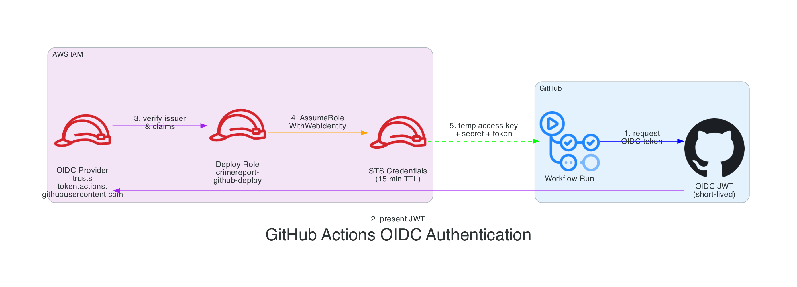
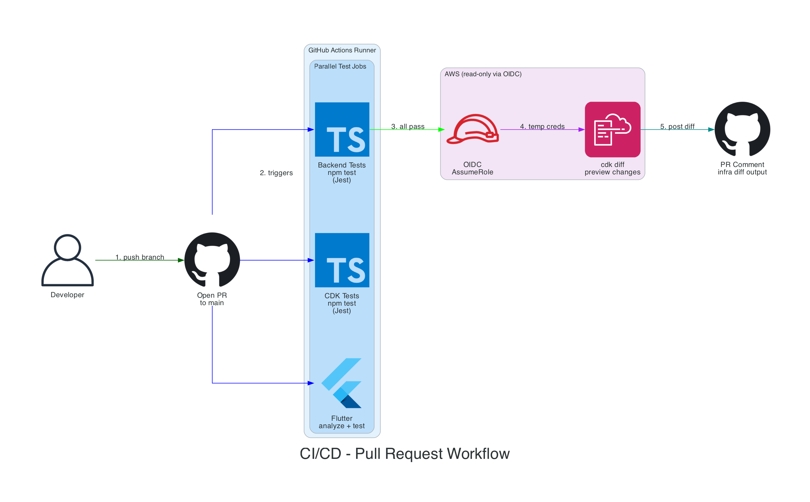
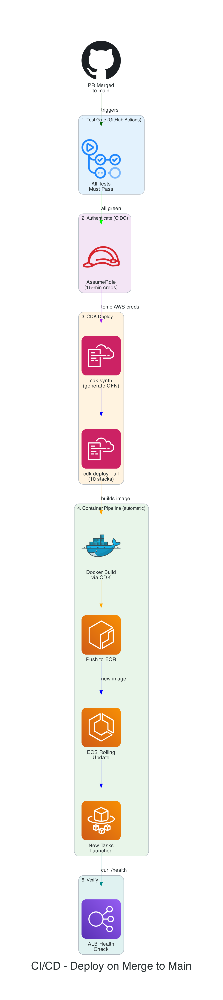

# CI/CD Pipeline - Knowledge Base

Personal reference notes for understanding the CI/CD pipeline in the CrimeReport project.

*All workflow files are in [.github/workflows/](../../.github/workflows/)*
*OIDC CDK stack is in [infrastructure/aws/lib/cicd/](../../infrastructure/aws/lib/cicd/)*
*Diagram sources are in [diagrams/](diagrams/) -- regenerate with `python3 cicd_pipeline.py`*

---

## The Problem We're Solving

Right now we deploy by running `cdk deploy --all` from a laptop. This works, but it's dangerous:

| Manual Deploy Risk | What Goes Wrong |
|-|-|
| No test gate | You can deploy broken code -- nothing forces tests to pass first |
| "Works on my machine" | Local env differences (Node version, AWS credentials, env vars) cause inconsistent deploys |
| No audit trail | Nobody knows *who* deployed *what* and *when* |
| Human error | Typos, wrong branch, forgot to pull, half-finished merge |
| Single point of failure | Only people with AWS credentials can deploy |

**CI/CD solves all of this.** Every code change goes through an automated pipeline that tests, validates, and deploys -- the same way, every time, with a full audit log in GitHub.

### What "CI/CD" Actually Means

- **CI (Continuous Integration)** -- Every time you push code, automated tests run. If they fail, the PR is blocked. This catches bugs *before* they reach `main`.
- **CD (Continuous Deployment)** -- Every time code merges to `main`, it automatically deploys to production. No manual steps.

---

## How GitHub Actions Works

GitHub Actions is CI/CD built directly into GitHub. No separate service to manage -- it reads YAML files from your repo and runs them on GitHub-hosted virtual machines.

### Core Concepts

```
Repository
└── .github/
    └── workflows/
        ├── pr.yml          ← runs on every pull request
        └── deploy.yml      ← runs on merge to main
```

| Concept | What It Is |
|-|-|
| **Workflow** | A YAML file in `.github/workflows/`. Each file is an independent automation |
| **Trigger** | The event that starts a workflow (`push`, `pull_request`, `workflow_dispatch`) |
| **Job** | A unit of work that runs on a fresh VM. Jobs in a workflow run in parallel by default |
| **Step** | A single command or action within a job. Steps run sequentially |
| **Runner** | The VM that executes a job. We use `ubuntu-latest` (free for public repos) |
| **Action** | A reusable step published on the GitHub Marketplace (e.g., `actions/checkout@v4`) |

### How It Looks in the GitHub UI

When you open a PR or push to `main`, GitHub shows a **Checks** section at the bottom of the PR with a live status for each job (green checkmark, yellow spinner, red X). Clicking into a check shows the full log output for every step, with collapsible sections and timestamps.

---

## OIDC Authentication (No Long-Lived Keys)

The workflow needs AWS credentials to run `cdk diff` and `cdk deploy`. The naive approach is to store `AWS_ACCESS_KEY_ID` / `AWS_SECRET_ACCESS_KEY` as GitHub secrets. **This is bad practice** because:

- Long-lived keys are a security risk (if leaked, attacker has permanent access)
- Keys need manual rotation
- Keys grant access 24/7, even when no workflow is running

**OIDC (OpenID Connect) federation** eliminates all of this. Instead of storing keys, GitHub and AWS establish a trust relationship:



### Step by Step

1. **GitHub Actions** requests a short-lived OIDC JWT token from GitHub's token service
2. The workflow **presents the JWT** to AWS STS (Security Token Service)
3. AWS has an **OIDC Provider** resource that trusts `token.actions.githubusercontent.com`
4. AWS verifies the JWT's claims (issuer, audience, repository, branch) and **assumes an IAM role**
5. STS returns **temporary credentials** (access key + secret + session token) that expire in 15 minutes

**Result:** No secrets stored anywhere. Credentials exist only for the duration of the workflow run.

### The Trust Chain

```
GitHub's OIDC Server  ──trusts──►  AWS IAM OIDC Provider  ──allows──►  Deploy IAM Role
                                                                           │
                                   Only if:                                │
                                   - issuer = token.actions.github...      │
                                   - repo = AbelShiferaw/crimereport       │
                                   - branch = main (for deploy)            │
                                                                           ▼
                                                              Temporary STS Credentials
                                                              (15 min, auto-expire)
```

### CDK Stack for OIDC

We create the OIDC provider and deploy role using CDK itself (a one-time bootstrap):

```typescript
// infrastructure/aws/lib/cicd/cicd-stack.ts

const oidcProvider = new iam.OpenIdConnectProvider(this, 'GithubOidc', {
  url: 'https://token.actions.githubusercontent.com',
  clientIds: ['sts.amazonaws.com'],
});

const deployRole = new iam.Role(this, 'GithubDeployRole', {
  roleName: `${PROJECT_PREFIX}-github-deploy`,
  assumedBy: new iam.FederatedPrincipal(
    oidcProvider.openIdConnectProviderArn,
    {
      StringEquals: {
        'token.actions.githubusercontent.com:aud': 'sts.amazonaws.com',
      },
      StringLike: {
        'token.actions.githubusercontent.com:sub':
          `repo:${GITHUB_REPO}:*`,
      },
    },
    'sts:AssumeRoleWithWebIdentity',
  ),
  managedPolicies: [
    iam.ManagedPolicy.fromAwsManagedPolicyName('AdministratorAccess'),
  ],
  maxSessionDuration: cdk.Duration.hours(1),
});
```

> **Bootstrap (one-time):** This stack must be deployed manually via `cdk deploy CrimeReport-Cicd` before the GitHub workflows can authenticate. After that, the workflows deploy everything else automatically.

---

## Our Two Workflows

### 1. PR Workflow (Quality Gate)

**Trigger:** Opening or updating a pull request targeting `main`.

**Purpose:** Catch problems *before* code reaches the main branch. Reviewers see test results and infrastructure diff directly on the PR.



```yaml
# .github/workflows/pr.yml (simplified)
on:
  pull_request:
    branches: [main]

jobs:
  backend-tests:          # npm test in backend/api/
  cdk-tests:              # npm test in infrastructure/aws/
  flutter-checks:         # flutter analyze + flutter test in apps/mobile/
  cdk-diff:               # cdk diff (requires OIDC auth to AWS)
    needs: [backend-tests, cdk-tests]  # only runs after tests pass
```

**What the developer sees on the PR:**

| Check | Status | Details |
|-|-|-|
| Backend Tests | Passed (136 tests) | Jest unit tests for models, routes, libs |
| CDK Tests | Passed (93 tests) | Infrastructure snapshot + assertion tests |
| Flutter Checks | Passed | `flutter analyze` (lint) + `flutter test` (10 tests) |
| CDK Diff | Passed | Comment posted with infrastructure changes preview |

The CDK diff step posts a **comment on the PR** showing exactly what infrastructure would change if merged. This lets reviewers approve infrastructure changes alongside code changes.

### 2. Deploy Workflow (Ship It)

**Trigger:** A push to the `main` branch (i.e., a PR was merged).

**Purpose:** Automatically deploy the latest code to production after verifying all tests pass.



```yaml
# .github/workflows/deploy.yml (simplified)
on:
  push:
    branches: [main]

jobs:
  test:                   # run all tests again (safety net)
  deploy:
    needs: [test]         # only deploys if tests pass
    steps:
      - configure AWS credentials (OIDC)
      - npm ci && npm run build (in infrastructure/aws/)
      - cdk deploy --all --require-approval never
  integration-tests:
    needs: [deploy]       # runs after deploy succeeds
    steps:
      - retrieve ALB DNS from CloudFormation outputs
      - npm test in integration-tests/ (17 tests against live API)
```

---

## What `cdk diff` vs `cdk deploy` Does

Think of it like "preview" vs "apply" (same concept as Terraform `plan`/`apply`):

| Command | What It Does | When We Use It |
|-|-|-|
| `cdk diff` | Compares your local CDK code against what's currently deployed in AWS. Shows what *would* change (added, removed, modified resources). **Makes zero changes.** | In the PR workflow -- gives reviewers a preview |
| `cdk deploy` | Actually applies the changes to AWS via CloudFormation. Creates, updates, or deletes real resources. | In the deploy workflow -- after merge to `main` |

Example `cdk diff` output (posted as PR comment):

```
Stack CrimeReport-Compute
Resources
[~] AWS::ECS::TaskDefinition ApiTaskDef
 └── [~] ContainerDefinitions
     └── [~] Environment
         └── [+] Added: { Name: "NEW_VAR", Value: "hello" }
```

This tells the reviewer: "Merging this PR will add a new environment variable to the ECS task."

---

## Test Gate Breakdown

All tests must pass before any deployment. Here's what runs:

### Backend API Tests (`backend/api/`)

```bash
cd backend/api && npm ci && npm test
```

- **Framework:** Jest
- **What's tested:** Route handlers, database models, SNS client, push subscription logic, validation schemas, Socket.io broadcasting
- **Runs in:** ~15 seconds

### CDK Infrastructure Tests (`infrastructure/aws/`)

```bash
cd infrastructure/aws && npm ci && npm run build && npm test
```

- **Framework:** Jest + CDK assertions
- **What's tested:** Each stack generates the expected CloudFormation resources (security groups, IAM policies, ECS task definitions, etc.)
- **Runs in:** ~20 seconds

### Flutter App Checks (`apps/mobile/`)

```bash
cd apps/mobile && flutter pub get && flutter analyze && flutter test
```

- **`flutter analyze`:** Static analysis (linting) -- catches unused imports, type errors, style violations
- **`flutter test`:** Runs unit tests for providers, models, utilities
- **Runs in:** ~30 seconds

---

## How It Connects to Our Existing Stacks

`cdk deploy --all` deploys these 10 stacks in dependency order (CDK figures out the order automatically):

```
CrimeReport-Network      ← VPC, subnets, NAT Gateway
CrimeReport-Waf          ← WAF rate limiting + managed rules
CrimeReport-Security     ← Security groups (ALB, ECS, DB, Redis)
CrimeReport-Iam          ← IAM roles (ECS task + execution)
CrimeReport-Database     ← Aurora Serverless v2 PostgreSQL
CrimeReport-Cache        ← ElastiCache Redis
CrimeReport-Media        ← S3 buckets, CloudFront CDN, Step Functions
CrimeReport-Sns          ← SNS platform app ARNs (from SSM)
CrimeReport-Compute      ← ECS Fargate, ALB, auto-scaling, Docker build
CrimeReport-Monitoring   ← CloudWatch alarms + dashboard
```

The dependency graph (from [`infrastructure/aws/bin/crimereport-stack.ts`](../../infrastructure/aws/bin/crimereport-stack.ts)):

```
Network ──► Security ──► Database
    │            │            │
    │            ▼            ▼
    │          Cache      Compute ◄── Iam, Waf, Media, Sns
    │                        │
    │                        ▼
    └─────────────────► Monitoring
```

CDK only updates stacks whose templates have actually changed. If you only modify backend code (inside `ComputeStack`'s Docker image), only `CrimeReport-Compute` gets redeployed. The other 9 stacks are skipped with "no changes."

---

## The OIDC CDK Stack

This is a new stack added specifically for CI/CD. It's separate from the other 10 stacks because it must be deployed *before* GitHub Actions can authenticate.

**File:** `infrastructure/aws/lib/cicd/cicd-stack.ts`

**What it creates:**

| Resource | Purpose |
|-|-|
| `AWS::IAM::OIDCProvider` | Tells AWS to trust JWTs from `token.actions.githubusercontent.com` |
| `AWS::IAM::Role` (`crimereport-github-deploy`) | The role GitHub Actions assumes. Has `AdministratorAccess` to deploy all stacks |

**Why `AdministratorAccess`?** CDK needs broad permissions because it creates many different resource types (ECS, RDS, S3, Lambda, CloudFormation, etc.). In a production corporate environment, you'd scope this down to specific services. For our project, `AdministratorAccess` keeps things simple.

**Bootstrap process (one-time, from laptop):**

```bash
cd infrastructure/aws
npm run build
npx cdk deploy CrimeReport-Cicd
```

After this, you never need to deploy from your laptop again.

---

## Workflow File Structure

```
.github/
└── workflows/
    ├── pr.yml              ← quality gate on pull requests
    └── deploy.yml          ← auto-deploy on merge to main
```

### Key Workflow Patterns

**Caching dependencies** -- We cache `node_modules` and Flutter pub cache to speed up runs:

```yaml
- uses: actions/cache@v4
  with:
    path: ~/.npm
    key: ${{ runner.os }}-node-${{ hashFiles('**/package-lock.json') }}
```

**Concurrency control** -- Only one deploy runs at a time (prevents conflicting CloudFormation updates):

```yaml
concurrency:
  group: deploy-production
  cancel-in-progress: false   # don't cancel in-progress deploys
```

**OIDC credential step** (used in both workflows):

```yaml
- uses: aws-actions/configure-aws-credentials@v4
  with:
    role-to-assume: arn:aws:iam::ACCOUNT_ID:role/crimereport-github-deploy
    aws-region: us-east-1
```

---

## Future Improvements

These are not part of Milestone 24.5 but are natural next steps:

| Improvement | What It Adds |
|-|-|
| **Staging environment** | Deploy to staging first, run integration tests, then promote to production |
| **Bake period** | Wait N minutes after staging deploy, check CloudWatch alarms, auto-rollback if unhealthy |
| **Canary deploys** | Route 5% of traffic to new version, monitor errors, gradually increase |
| **Mobile builds** | Build Flutter APK/IPA in CI, upload to Play Store / TestFlight |
| **Slack notifications** | Post deploy status to a Slack channel |
| **Branch deploys** | Deploy feature branches to temporary preview environments |

---

## Quick Reference

### Commands

| Task | Command |
|-|-|
| Bootstrap OIDC (one-time) | `cd infrastructure/aws && npx cdk deploy CrimeReport-Cicd` |
| Manually trigger deploy | Push to `main` or use GitHub Actions "Re-run" button |
| View workflow runs | `https://github.com/AbelShiferaw/crimereport/actions` |
| View deploy logs | Click into any workflow run on GitHub |
| Check current deploy | `curl https://<ALB-DNS>/health/ready` |

### Environment Variables / Secrets

| Name | Where | Purpose |
|-|-|-|
| `AWS_ACCOUNT_ID` | GitHub Actions variable | Used to construct the role ARN for OIDC |
| `AWS_REGION` | GitHub Actions variable | Deployment region (`us-east-1`) |
| (none) | -- | No secrets needed -- OIDC handles auth |
