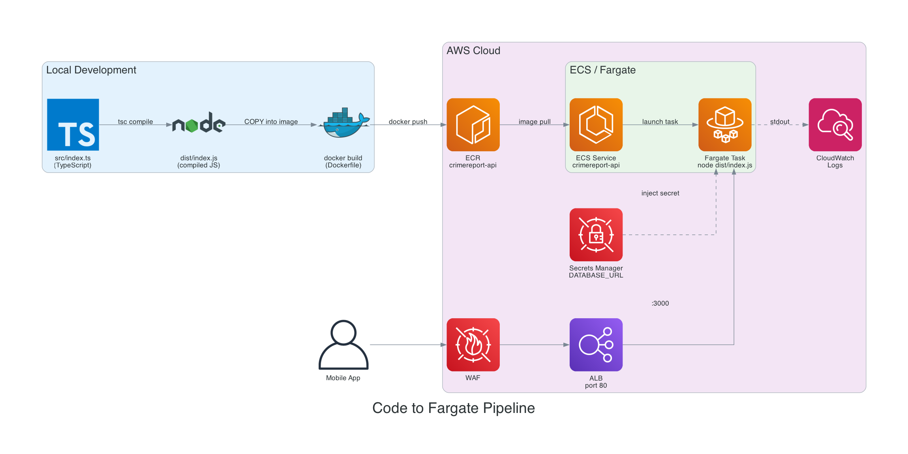
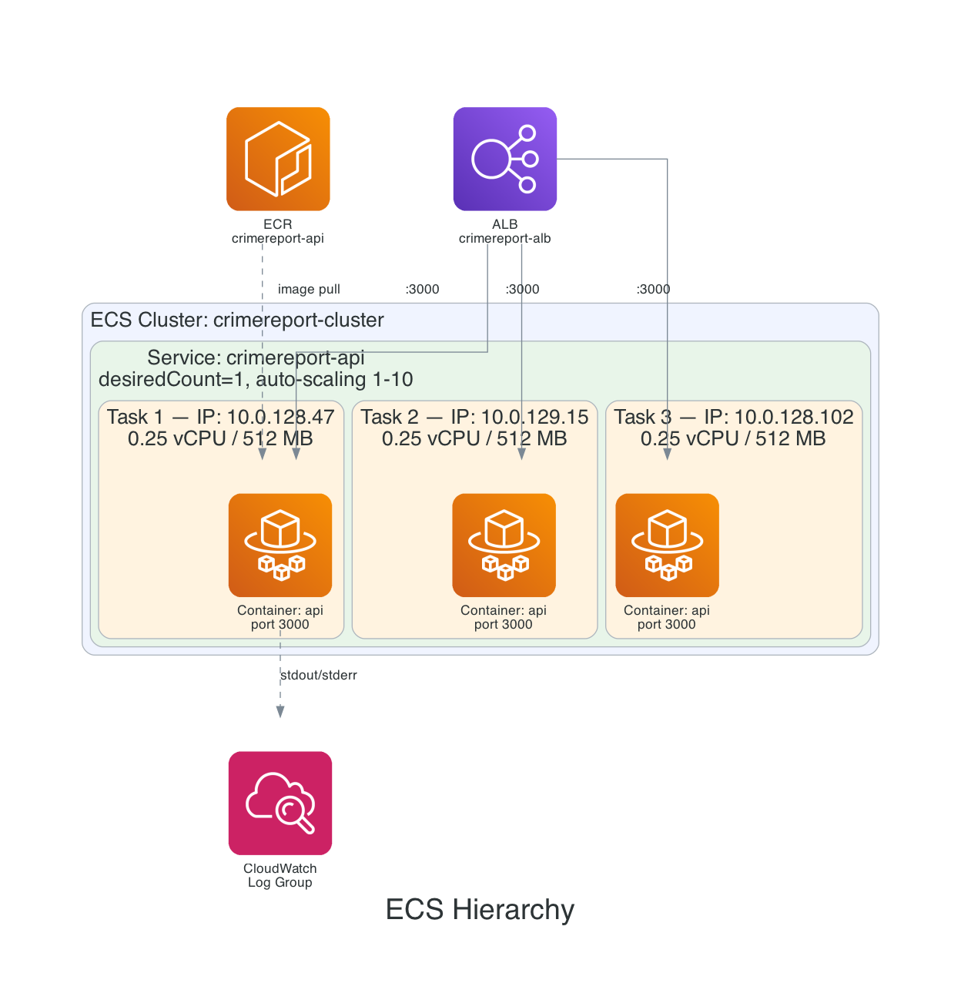
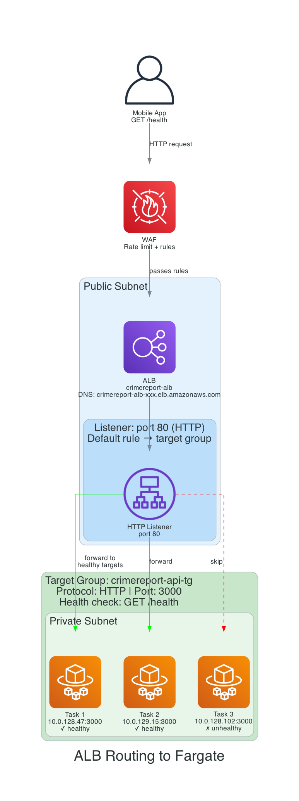

# ECS Fargate & Compute - Knowledge Base

Personal reference notes for understanding the ECS Fargate compute layer in the CrimeReport project.

*All infrastructure code is in [infrastructure/aws/lib/compute/compute-stack.ts](../../infrastructure/aws/lib/compute/compute-stack.ts)*
*Diagram sources are in [diagrams/](diagrams/) -- regenerate with `python3 <script>.py`*

---

## The Problem We're Solving

We have a Node.js API server (`backend/api/src/index.ts`) that runs locally with `node dist/index.js`. To run it in the cloud for real users, we need:

1. A way to **package** the app so it runs identically anywhere
2. A place to **store** that package
3. Something to **run** it in the cloud
4. Something to **distribute traffic** across copies
5. Something to **replace** crashed copies and **scale** based on demand

ECS Fargate handles items 3-5. Docker and ECR handle 1-2.

---

## Express.js (Our API Framework)

Express is a minimal web framework for Node.js. If you've used Flask (Python), Express is the direct equivalent.

### Flask vs Express Side-by-Side

**Flask (Python):**
```python
from flask import Flask, jsonify
app = Flask(__name__)

@app.route('/health')
def health():
    return jsonify({'status': 'ok'})

@app.route('/api/v1/reports', methods=['GET'])
def get_reports():
    return jsonify({'reports': []})

app.run(port=3000)
```

**Express (TypeScript):**
```typescript
import express from 'express';
const app = express();

app.get('/health', (req, res) => {
  res.json({ status: 'ok' });
});

app.get('/api/v1/reports', (req, res) => {
  res.json({ reports: [] });
});

app.listen(3000);
```

### Concept Mapping

| Flask (Python) | Express (TypeScript) |
|---|---|
| `@app.route('/path')` | `app.get('/path', handler)` |
| `return jsonify({...})` | `res.json({...})` |
| `request.args.get('q')` | `req.query.q` |
| `request.json` | `req.body` (with `express.json()` middleware) |
| `@app.before_request` | `app.use(middleware)` |
| `app.run(port=3000)` | `app.listen(3000)` |
| Flask blueprints | Express Router |

### Middleware

Express uses middleware functions that every request passes through (like Flask extensions):

```typescript
app.use(helmet());        // Adds security headers (like Flask-Talisman)
app.use(cors());          // Handles Cross-Origin Resource Sharing (like Flask-CORS)
app.use(express.json());  // Parses JSON request bodies (Flask does this automatically)
```

### Our Express + Socket.io Setup

Our `index.ts` runs both a REST API and WebSocket server on the same port:

```typescript
const app = express();                    // Express app for REST routes
const httpServer = createServer(app);     // Wrap in HTTP server
const io = new SocketServer(httpServer);  // Attach Socket.io to same server

httpServer.listen(3000);                  // Both REST and WebSocket on port 3000
```

REST calls (`GET /api/v1/reports`) and WebSocket upgrades (`GET /socket.io/?transport=websocket`) both arrive on port 3000. The HTTP server routes them internally.

---

## TypeScript Compilation

We write in TypeScript (`.ts` files) but Node.js can only run JavaScript (`.js` files). A compile step bridges the gap:

```
src/index.ts  ──(tsc compiler)──>  dist/index.js
(what you write)                   (what Node.js runs)
```

**Why TypeScript?** Type safety catches bugs at compile time that JavaScript would only catch at runtime:

```typescript
function getReport(id: number) { ... }
getReport("abc");  // TypeScript ERROR at compile time
                   // JavaScript would silently pass "abc" and break at runtime
```

### The Build Commands

| Command | What it does |
|---------|-------------|
| `npm run build` | Runs `tsc` (TypeScript compiler), reads `tsconfig.json`, outputs JS to `dist/` |
| `npm run dev` | Runs `ts-node-dev` which compiles + runs + auto-restarts on file changes (local dev only) |
| `npm start` | Runs `node dist/index.js` (the compiled output, used in production) |

### The Compilation Flow

```
backend/api/
├── src/
│   └── index.ts          ← You write TypeScript here
├── dist/
│   └── index.js          ← tsc compiles to JavaScript here
├── tsconfig.json         ← Compiler config (target ES version, output dir, etc.)
├── package.json          ← Dependencies + scripts
└── Dockerfile            ← Packages everything into a container
```

---

## Docker & Container Images

A **container image** is a self-contained package with your app, its runtime, and all dependencies. Think of it as a snapshot of everything your app needs to run.

### Dockerfile (Multi-Stage Build)

Our Dockerfile has two stages:

```
Stage 1: "builder"                    Stage 2: final image
┌─────────────────────────┐          ┌─────────────────────────┐
│ Node.js 20              │          │ Node.js 20              │
│ ALL npm packages        │          │ Production npm packages │
│ TypeScript compiler     │   copy   │ Compiled JS (dist/)     │
│ Source code (src/)      │ -------> │ curl (for health check) │
│ Compiled JS (dist/)     │  dist/   │                         │
│ ~400 MB                 │  only    │ ~150 MB                 │
└─────────────────────────┘          └─────────────────────────┘
```

**Why multi-stage?** Stage 1 compiles TypeScript and has dev dependencies (test libraries, type definitions, etc.). Stage 2 starts fresh, copies only the compiled output and production dependencies. The final image is much smaller and has a smaller attack surface.

### Key Dockerfile commands

| Command | Purpose |
|---------|---------|
| `FROM node:20-alpine` | Base image (Alpine Linux = tiny, ~5 MB) |
| `COPY package*.json ./` + `RUN npm ci` | Install dependencies (cached by Docker if package.json hasn't changed) |
| `COPY --from=builder /app/dist ./dist` | Copy compiled JS from stage 1 |
| `EXPOSE 3000` | Documents which port the container listens on (informational only) |
| `USER node` | Run as non-root user (security best practice) |
| `CMD ["node", "dist/index.js"]` | The command that runs when the container starts |

---

## ECR (Elastic Container Registry)

ECR is AWS's private Docker image registry. Like Docker Hub but private and within your AWS account.

### Push Flow

```
Local machine                       AWS ECR
┌───────────────┐                  ┌─────────────────────────────┐
│ docker build  │                  │ crimereport-api             │
│ docker tag    │ --- push --->    │   :latest                   │
│ docker push   │                  │   :v1.0.0                   │
└───────────────┘                  │   :v1.1.0                   │
                                   │   (max 10 images kept)      │
                                   └─────────────────────────────┘
```

### Our ECR Config

- **`imageScanOnPush: true`** -- Every pushed image is scanned for known CVEs (security vulnerabilities)
- **`lifecycleRules: maxImageCount: 10`** -- Keeps last 10 images, auto-deletes older ones to save storage costs
- **`removalPolicy: DESTROY`** -- Repo is deleted when stack is torn down (use `RETAIN` in production)

---

## How Docker Images Are Stored

A Docker image is **not a single file** -- it's a **stack of layers**, each stored as a compressed tarball.

### Layers

Every line in the Dockerfile that modifies the filesystem creates a new layer:

```
┌─────────────────────────────────┐
│ Layer 5: dist/index.js (50 KB)  │  ← your code (changes often)
├─────────────────────────────────┤
│ Layer 4: node_modules/ (80 MB)  │  ← changes when you add a package
├─────────────────────────────────┤
│ Layer 3: curl binary (3 MB)     │  ← rarely changes
├─────────────────────────────────┤
│ Layer 2: /app directory (0 KB)  │  ← never changes
├─────────────────────────────────┤
│ Layer 1: Node.js + Alpine (50 MB)│  ← never changes (unless you upgrade Node)
└─────────────────────────────────┘
```

Each layer is:
- A **compressed tar archive** (`.tar.gz`) containing only the files that changed in that step
- Identified by a **SHA256 hash** (e.g., `sha256:a3ed95caeb02...`)
- **Immutable** -- once created, it never changes

### Why Layers Matter

**Caching**: When you rebuild, Docker reuses layers that haven't changed. If you only changed your TypeScript code, Docker skips layers 1-4 (already cached) and only rebuilds layer 5. This is why the Dockerfile copies `package.json` and runs `npm ci` **before** copying source code -- the dependency layer is cached unless `package.json` changes.

**Efficient transfer**: When you push to ECR, only layers that ECR doesn't already have are uploaded. If you push a second image that only changed your code, only the tiny 50 KB layer 5 is transferred -- not the entire 133 MB image.

### Where Images Live

**On your local machine**: Docker stores layers in its internal storage (`/var/lib/docker/` on Linux, or inside the Docker Desktop VM on Mac). You don't interact with these files directly.

**In ECR**: Each layer is stored as a blob. The image is represented by a **manifest** -- a JSON file listing all layer hashes in order:

```json
{
  "layers": [
    { "digest": "sha256:a3ed95c...", "size": 52428800 },
    { "digest": "sha256:b7f89d2...", "size": 0 },
    { "digest": "sha256:c4e8a01...", "size": 3145728 },
    { "digest": "sha256:d9f12b3...", "size": 83886080 },
    { "digest": "sha256:e1a37c4...", "size": 51200 }
  ]
}
```

When Fargate pulls the image, it downloads the manifest, then downloads each layer it doesn't already have, stacks them together, and that becomes the container's filesystem.

### Exporting an Image as a Single File

You can save an image to a `.tar` file for offline transfer:

```bash
docker save crimereport-api:latest -o crimereport-api.tar   # ~133 MB .tar file
docker load -i crimereport-api.tar                           # restore on another machine
```

This is only used for air-gapped environments. Normally you push/pull through a registry (ECR) which handles layers individually and is much more efficient.

### Image Terminology

| Concept | What it is |
|---------|-----------|
| **Layer** | A compressed tar of filesystem changes from one Dockerfile step |
| **Image** | An ordered stack of layers + a manifest listing them |
| **Manifest** | JSON file listing layer hashes, image name/tag, and config |
| **Tag** | A human-readable label pointing to a specific manifest (e.g., `latest`, `v1.0.0`) |
| **Registry** | Where images are stored and pulled from (ECR, Docker Hub) |

---

## Complete Flow: Code to Running in Fargate



This is the end-to-end journey from writing code to having a live API:

```
YOUR LAPTOP                              AWS CLOUD

 1. Write TypeScript
    src/index.ts

 2. npm run build
    (tsc compiles .ts → .js)
         ↓
    dist/index.js

 3. docker build .
    (Dockerfile executes)
         ↓
    Docker Image                                ECR
    (frozen snapshot:             docker push    (image storage)
     Node.js + deps +          ──────────────→  crimereport-api:latest
     dist/index.js)                                    │
                                                       │
                                        ECS Service: "run 1 task"
                                                       │
                                                       ▼
                                   4. Fargate provisions 0.25 vCPU + 512 MB
                                                       │
                                   5. ECS agent (execution role) pulls image from ECR
                                                       │
                                   6. ECS agent fetches DATABASE_URL from Secrets Manager
                                                       │
                                   7. Fargate creates container with env vars + secrets
                                                       │
                                   8. Fargate runs CMD: node dist/index.js
                                                       │
                                   9. Express app starts:
                                      - Reads process.env.PORT (3000)
                                      - Reads process.env.DATABASE_URL (from secret)
                                      - Reads process.env.REDIS_HOST (from env)
                                      - Sets up middleware (helmet, cors, json)
                                      - Defines routes (/health, /api/v1)
                                      - Starts Socket.io
                                      - Listens on port 3000
                                                       │
                                   10. CloudWatch receives:
                                       "🚀 CrImEreport API running on port 3000"
                                                       │
                                   11. After 60s startPeriod, health checks begin:
                                       curl localhost:3000/health → 200 OK
                                                       │
                                   12. ECS marks task healthy
                                       ALB starts routing traffic to task IP:3000
                                                       │
                                                       ▼
                                   13. Mobile app can now hit:
                                       GET http://crimereport-alb-xxx.elb.amazonaws.com/health
                                       → WAF → ALB:80 → Target Group → Task:3000
                                       → Express handler → { "status": "ok" }
```

### Key Distinction: Build vs Run

The Dockerfile **builds** the image (creates the frozen snapshot). It does NOT run the app. Fargate **runs** the image by executing the `CMD` command (`node dist/index.js`) inside provisioned compute.

```
docker build .          = Creates the image (build time)
CMD ["node", "..."]     = What Fargate runs inside the image (run time)
```

You never "run the Dockerfile." You build it into an image, push it to ECR, and Fargate runs it.

---

## ECS Concepts Hierarchy



This is the most important mental model to understand:

```
ECS Cluster (logical grouping -- like a namespace)
│
├── Service A: "crimereport-api" (manager that ensures N tasks run)
│   ├── Task 1 (running instance, IP: 10.0.128.47)
│   │   └── Container: api (Node.js on port 3000)
│   ├── Task 2 (running instance, IP: 10.0.129.15)
│   │   └── Container: api (Node.js on port 3000)
│   └── Task 3 (running instance, IP: 10.0.128.102)
│       └── Container: api (Node.js on port 3000)
│
└── Service B: "background-worker" (hypothetical second service)
    └── Task 1 (running instance, IP: 10.0.129.88)
        └── Container: worker (processes jobs)
```

### Cluster

A logical namespace. Groups services together. Does not create any compute. You could have multiple services in one cluster (API, workers, admin dashboard, etc.).

### Task Definition

The **blueprint/recipe** that tells ECS how to run your container(s). It specifies:
- CPU and memory allocation
- Which Docker image to use
- Environment variables and secrets
- IAM roles
- Health checks
- Port mappings

Task definitions are **versioned**. Each update creates a new revision:
- `crimereport-api:1` (initial)
- `crimereport-api:2` (you changed the image)
- `crimereport-api:3` (you added an env var)

This history lets you roll back to a previous revision if needed.

### Task

A **running instance** of a task definition. Each task gets:
- Its own private IP address (via an ENI -- Elastic Network Interface)
- Its own copy of all containers defined in the task definition
- Isolated compute (CPU/memory)

If you have `desiredCount: 3`, there are 3 independent tasks, each with its own IP.

### Service

The **manager** that keeps tasks running. It:
- Maintains the desired count of tasks
- Replaces crashed/unhealthy tasks automatically
- Registers tasks with the ALB target group
- Handles rolling deployments (spin up new, drain old)
- Integrates with auto-scaling

### Container

The actual running process inside a task. A task can have **multiple containers** that:
- Share the same private IP (communicate via `localhost`)
- Share the same lifecycle (start and stop together)
- Have separate port mappings, health checks, and resource limits

---

## Fargate vs EC2 Launch Types

| Aspect | Fargate | EC2 |
|--------|---------|-----|
| Server management | None (serverless) | You manage EC2 instances |
| Scaling | Per-task, automatic | Must scale the instance pool + tasks |
| Patching | AWS handles it | You patch the OS |
| Cost | Pay per task (CPU + memory + duration) | Pay for instances (even if underutilized) |
| Startup time | ~30-60 seconds | Depends on instance pool availability |
| Control | Less (no SSH, no host access) | Full (SSH, custom AMIs, GPUs) |
| Best for | Most workloads, MVPs | GPU workloads, very cost-sensitive at scale |

**We chose Fargate** because for an MVP, zero operational overhead is worth the slightly higher per-unit cost. No servers to patch, no capacity planning.

**Key point**: Fargate is not a persistent server. There is no "Fargate instance" that sticks around. Every time a task needs to run, AWS provisions fresh compute. When a task stops, that compute disappears. The service just ensures the desired number of tasks are always running.

---

## Two IAM Roles in ECS

ECS uses two separate roles at different phases of the container lifecycle:

```
Phase 1: Container Startup              Phase 2: App Runtime
(Execution Role)                        (Task Role)
┌────────────────────────────┐          ┌────────────────────────────┐
│ ECS Agent authenticates    │          │ Node.js app is running     │
│ with ECR                   │          │                            │
│         ↓                  │          │ App calls S3 for           │
│ Pulls Docker image         │          │ presigned URLs             │
│         ↓                  │          │         ↓                  │
│ Fetches DATABASE_URL from  │          │ App calls SNS to send      │
│ Secrets Manager            │          │ notifications              │
│         ↓                  │          │         ↓                  │
│ Creates CloudWatch log     │          │ App reads SSM parameters   │
│ stream                     │          │                            │
│         ↓                  │          │ (Uses task role credentials │
│ Starts container with      │          │  automatically via SDK)    │
│ injected secrets           │          │                            │
└────────────────────────────┘          └────────────────────────────┘
```

| Role | Who Uses It | When | Permissions |
|------|------------|------|-------------|
| **Execution Role** | AWS infrastructure (ECS agent) | Before/during container startup | ECR pull, CloudWatch logs, Secrets Manager read |
| **Task Role** | Your application code | At runtime | S3, SNS, Rekognition, SSM -- whatever your app needs |

**Analogy**: The execution role is the **backstage crew** that sets up the stage (pulls the image, wires up logs, injects secrets). The task role is the **actor on stage** (your app doing its actual work).

### Why the Execution Role Lives in ComputeStack (Not IamStack)

CDK auto-grants the execution role permissions to write to the CloudWatch log group. If the role is in Stack A and the log group is in Stack B, CDK creates a cross-stack reference from A to B. But Stack B already depends on Stack A (for the role), creating a cycle. Keeping both in the same stack avoids this.

---

## Environment Variables vs Secrets

Two ways to inject configuration into containers:

### `environment` (Plain Text)

```typescript
environment: {
  NODE_ENV: 'production',
  PORT: '3000',
  REDIS_HOST: 'redis.cache.amazonaws.com',
}
```

- Stored as plain text in the task definition
- Visible in the AWS console and CloudFormation templates
- Use for **non-sensitive** config: mode flags, port numbers, service endpoints

### `secrets` (From Secrets Manager)

```typescript
secrets: {
  DATABASE_URL: ecs.Secret.fromSecretsManager(dbSecret),
}
```

Flow at container startup:
1. Task definition stores only the **secret ARN** (not the value)
2. ECS agent (using execution role) calls Secrets Manager to fetch the actual value
3. The value is injected as an environment variable into the container
4. App reads `process.env.DATABASE_URL` normally

- The actual password **never appears** in task definitions, CloudFormation, or the ECS console
- When the secret is **rotated** in Secrets Manager, new tasks automatically get the new value
- Use for **credentials**: database passwords, API keys, tokens

---

## Container Health Check

```typescript
healthCheck: {
  command: ['CMD-SHELL', 'curl -f http://localhost:3000/health || exit 1'],
  interval: cdk.Duration.seconds(30),
  timeout: cdk.Duration.seconds(5),
  retries: 3,
  startPeriod: cdk.Duration.seconds(60),
}
```

ECS runs this command **inside the container** at regular intervals:

```
Timeline for a cold start:

0s          60s         90s         120s        150s
|-----------|-----------|-----------|-----------|
 startPeriod  check #1    check #2    check #3
 (no checks)  pass/fail?  pass/fail?  pass/fail? -> UNHEALTHY if 3 fails
```

- **`startPeriod: 60s`** -- Grace period for app boot. Failures during this window are ignored.
- **`interval: 30s`** -- Run the check every 30 seconds after the start period
- **`timeout: 5s`** -- Each check must complete in 5 seconds or it's a failure
- **`retries: 3`** -- Must fail 3 **consecutive** times to be marked unhealthy (tolerates single blips)
- Worst case detection time: `60 + (3 x 30) = 150 seconds`

### Container Health Check vs ALB Health Check

These are **two independent checks** with different purposes:

| Aspect | Container Health Check | ALB Health Check |
|--------|----------------------|------------------|
| Who runs it | ECS (inside the container) | ALB (from outside, over the network) |
| What it checks | `curl localhost:3000/health` | HTTP GET to `<task-ip>:3000/health` |
| Consequence of failure | ECS **replaces** the container | ALB **stops routing traffic** to the target |
| Scope | Container lifecycle | Traffic routing |

Having both provides defense in depth: the ALB protects users from hitting broken targets, and ECS ensures broken containers get replaced.

---

## Application Load Balancer (ALB)



The ALB is the **front door** to the API. It sits in public subnets with a public DNS name and routes traffic to Fargate tasks in private subnets.

### Components

```
Internet
    │
    ▼
┌──────────────────────────────────────────┐
│ ALB (public subnet)                      │
│ DNS: crimereport-alb-xxx.elb.amazonaws.com│
│                                          │
│ ┌──────────────────────────────────────┐ │
│ │ Listener (port 80, HTTP)             │ │
│ │                                      │ │
│ │ Rules:                               │ │
│ │   Default → crimereport-api-tg       │ │
│ │   (future: /ws/* → websocket-tg)     │ │
│ └──────────────────────────────────────┘ │
└──────────────────────────────────────────┘
    │
    ▼
┌──────────────────────────────────────────┐
│ Target Group: crimereport-api-tg         │
│ Protocol: HTTP, Port: 3000              │
│ Health check: GET /health               │
│                                          │
│ Registered targets:                      │
│   10.0.128.47:3000  (healthy)           │
│   10.0.129.15:3000  (healthy)           │
│   10.0.128.102:3000 (unhealthy → skip) │
└──────────────────────────────────────────┘
```

### Listener

A rule on the ALB that says "when traffic arrives on port X with protocol Y, do Z." Our listener:
- Listens on **port 80** (HTTP)
- Forwards **all traffic** to the target group (default rule)
- Later we'll add HTTPS on port 443 with a domain + SSL certificate

### Target Group

Tells the ALB **where** to forward traffic and **how** to check target health:
- **`targetType: IP`** -- Fargate uses `awsvpc` mode where each task gets its own IP. The ALB routes directly to task IPs.
- **`port: 3000`** -- The port to hit on each target IP
- **`healthCheck: /health`** -- ALB pings this path to determine if a target can receive traffic
- **`healthyThresholdCount: 2`** -- 2 consecutive successful checks → target is healthy
- **`unhealthyThresholdCount: 3`** -- 3 consecutive failures → target is unhealthy, stop routing to it
- **`stickinessCookieDuration: 1 day`** -- Session stickiness for Socket.io WebSocket connections

### Port Translation

The internet client talks on port 80, but the container listens on port 3000:

```
Client request → ALB:80 → Target Group → Task IP:3000 → Container
```

The container never sees port 80.

### Listener Rules (Path-Based Routing)

With one service, all traffic goes to one target group. With multiple services, you use rules:

```
Listener (port 80)
  ├── Rule: /ws/*      → websocket-tg (port 4000)
  ├── Rule: /admin/*   → admin-tg (port 5000)
  └── Default          → api-tg (port 3000)
```

Rules can match on path, host header, HTTP method, query string, or headers. We currently use only the default rule.

---

## Fargate Service Configuration

### Network Placement

```typescript
this.service = new ecs.FargateService(this, 'ApiService', {
  vpcSubnets: { subnetType: ec2.SubnetType.PRIVATE_WITH_EGRESS },
  assignPublicIp: false,
  securityGroups: [ecsSecurityGroup],
});
```

- **Private subnets** -- Tasks have no public IP. Cannot be reached directly from the internet.
- **Egress via NAT Gateway** -- Tasks can make outbound calls (AWS APIs, external services) through the NAT Gateway.
- **Security group** -- Only allows inbound traffic from the ALB security group. This is the trust chain: Internet → WAF → ALB SG → ECS SG.

### Rolling Deployments

```typescript
minHealthyPercent: 50,
maxHealthyPercent: 200,
```

When deploying a new version of the container image:

```
desiredCount: 2, minHealthy: 50%, maxHealthy: 200%

Step 1: Running [Old v1] [Old v1]              (2 tasks, 100%)
Step 2: Launch  [Old v1] [Old v1] [New v2]     (3 tasks, 150% -- under 200% max)
Step 3: v2 healthy, drain v1                    (2 tasks)
Step 4: Launch  [Old v1] [New v2] [New v2]     (3 tasks)
Step 5: Drain last v1                           (2 tasks)
Step 6: Done    [New v2] [New v2]              (2 tasks, 100%)
```

- **`minHealthyPercent: 50`** -- At least 50% of desired count must stay healthy during deploy. With 1 task (MVP), this allows briefly having 0 (acceptable downtime for dev).
- **`maxHealthyPercent: 200`** -- Can temporarily run up to 2x tasks. This allows the new version to start before the old one is stopped.

---

## Auto-Scaling

```typescript
const scaling = this.service.autoScaleTaskCount({
  minCapacity: 1,    // never go below 1
  maxCapacity: 10,   // never exceed 10
});

scaling.scaleOnCpuUtilization('CpuScaling', {
  targetUtilizationPercent: 70,
  scaleInCooldown: cdk.Duration.seconds(300),   // 5 min after removing a task
  scaleOutCooldown: cdk.Duration.seconds(60),   // 1 min after adding a task
});
```

**Target tracking** -- AWS automatically adjusts task count to keep average CPU at ~70%.

```
CPU Load Over Time:

100% ─ ─ ─ ─ ─ ─ ─ ─ ─ ─ ─ ─ ─ ─ ─ ─ ─ ─ ─
 90%           ╱╲
 80%          ╱  ╲      scale out adds task
 70% ─ ─ ─ ╱─ ─ ─╲─ ─ ─ ─ ─ ─ ─ ─ ─ target
 60%       ╱       ╲   ╱╲
 50%      ╱         ╲ ╱  ╲
 40%     ╱           ╳    ╲  scale in removes task
 30%    ╱                  ╲
 20%   ╱                    ╲───────
```

### Cooldown Periods

- **`scaleOutCooldown: 60s`** -- After adding a task, wait 1 minute before considering adding another. Prevents over-scaling during brief spikes.
- **`scaleInCooldown: 300s`** -- After removing a task, wait 5 minutes before removing another. More conservative because removing a task disrupts active connections. Prevents flapping (rapidly adding and removing tasks).

### Cost Implications (0.25 vCPU / 512 MB Fargate)

```
 1 task  ≈ $9/month
 2 tasks ≈ $18/month
10 tasks ≈ $90/month
```

At MVP, we sit at 1 task (~$9/month). Auto-scaling adds tasks only when load demands it.

---

## WAF Association

```typescript
new wafv2.CfnWebACLAssociation(this, 'WafAlbAssociation', {
  resourceArn: this.alb.loadBalancerArn,
  webAclArn: wafAclArn,
});
```

Attaches the WAF Web ACL to the ALB. Every request is evaluated by WAF **before** reaching the ALB listener. WAF can block:
- Requests exceeding rate limits
- Known attack patterns (SQL injection, XSS)
- Requests from blocked IPs

If WAF blocks a request, it never reaches your containers.

---

## Multiple Containers in a Task

A task can have multiple containers. All containers in one task:
- Share the **same private IP** (communicate via `localhost`)
- Share the **same lifecycle** (start and stop together)
- Share the **CPU and memory budget** defined in the task definition

### Common Patterns

**Single container (our setup):**
```
Task (256 CPU, 512 MB)
└── api container (port 3000) -- Express + Socket.io
```

**Sidecar pattern:**
```
Task (512 CPU, 1024 MB)
├── api container (port 3000) -- main app
└── datadog-agent container (port 8125) -- metrics collection
```

**Multiple services:**
```
Task (512 CPU, 1024 MB)
├── api container (port 3000) -- REST API
└── websocket container (port 4000) -- WebSocket server
```

### Multiple Port Mappings on One Container

A single container can listen on multiple ports:

```typescript
container.addPortMappings(
  { containerPort: 3000 },  // Public API
  { containerPort: 9090 },  // Metrics endpoint (Prometheus)
  { containerPort: 9229 },  // Node.js debugger
);
```

Use cases:
- **App + metrics**: Port 3000 for users, port 9090 for Prometheus scraping (not exposed through ALB)
- **App + debugger**: Port 3000 for users, port 9229 for attaching a debugger in staging
- **HTTP + gRPC**: Port 3000 for REST, port 50051 for gRPC (service-to-service communication)

In our project, Socket.io and Express share port 3000, so we only need one port mapping.

---

## Full Request Flow (End-to-End)

Tracing `GET /health` from a mobile app:

```
1. Mobile App
   GET http://crimereport-alb-xxx.elb.amazonaws.com/health
                              │
2. WAF                        │
   Checks rate limits,        │
   attack patterns             │
   ✓ Passes                   │
                              ▼
3. ALB (public subnet)
   Listener on port 80
   Default rule → crimereport-api-tg
                              │
4. Target Group               │
   Picks healthy target       │
   10.0.128.47:3000           │
                              ▼
5. Fargate Task (private subnet)
   IP: 10.0.128.47
   Container: api, port 3000
                              │
6. Express Route Handler      │
   app.get('/health', ...)    │
                              ▼
7. Response: 200 OK
   { "status": "ok", "timestamp": "2026-02-20T..." }
                              │
                              ▼
   Back through ALB to mobile app
```

---

## CloudFormation Outputs

After deploying, these values are printed to the terminal:

| Output | Use |
|--------|-----|
| `EcrRepositoryUri` | URI for pushing Docker images |
| `ClusterName` | Needed for `aws ecs` CLI commands |
| `ServiceName` | Needed for triggering deployments |
| `AlbDnsName` | **The URL to hit your API** (e.g., `http://crimereport-alb-xxx.elb.amazonaws.com/health`) |
| `AlbArn` | Used by other stacks that reference the ALB |

---

## Our Config Values

| Constant | Value | Meaning |
|----------|-------|---------|
| `ECS_CPU` | 256 | 0.25 vCPU per task |
| `ECS_MEMORY` | 512 | 512 MB RAM per task |
| `ECS_DESIRED_COUNT` | 1 | 1 task at baseline (MVP) |
| `ECS_MIN_TASKS` | 1 | Auto-scaling floor |
| `ECS_MAX_TASKS` | 10 | Auto-scaling ceiling |
| `ECS_CPU_TARGET_PERCENT` | 70 | Scale when avg CPU exceeds 70% |
| `ECR_MAX_IMAGE_COUNT` | 10 | Keep last 10 Docker images |
| `LOG_RETENTION_DAYS` | 30 | Delete logs after 30 days |
| `API_PORT` | 3000 | Express server listen port |
